# 前言

1. ★大概率必考
2. 致谢：[hwl](https://william3242.github.io/2023/04/29/%E4%BA%BA%E5%B7%A5%E6%99%BA%E8%83%BD%E5%AF%BC%E8%AE%BA%E5%A4%8D%E4%B9%A0%E6%8C%87%E5%8D%97/)、lyf

# 题型

1. 问答：5*10分
2. 综合：15分
3. 设计：25分
4. 开放题/论述题：10分

# 重点

1. 书p101例3.9，a卷考；ppt第三章例题3为b卷
2. 图搜索：bfs等
3. 启发式搜索：a*
4. 对AI发展的看法以及研究热点

# 书上习题

# 第1章

## 人工智能的定义

### 智能

* 思考与理解能力
* 智能是一种应用知识处理环境的能力或由目标准则衡量的抽象思考能力

### 智能机器

* 一种能够呈现出人类智能行为的机器

  > 智能行为：人类用大脑考虑问题或创造思想

* 一种能在不确定环境中执行各种拟人任务并达到预期目标的机器

### 人工智能（学科）

人工智能（学科)是计算机科学中涉及研究、设计和应用智能机器的一个分支。近期主要目标在于研究用机器来模仿和执行人脑的某些智力功能，并开发相关理论和技术。

### 人工智能（能力）

人工智能（能力）是智能机器所执行的通常与人类智能有关的智能行为，如判断、推理、证明、识别、感知、理解、通信、设计、思考、规划、学习和问题求解等思维活动。

### 定义

## 人工智能的发展

### 国际

1. 孕育时期（-1956）
2. 形成时期（1956-1970）
3. 暗淡时期（1966-1974）
4. 知识应用时期（1970-1988）
5. 集成发展时期（1986-2010）
6. 融合发展时期（2011-）

### 中国

1. 迷雾重重
2. 艰难起步
3. 迎来曙光
4. 蓬勃发展
5. 国家战略

## 人工智能的各种认知观

### 符号主义/逻辑主义/心理学派

> 传统人工智能

认为人工智能源于数理逻辑。

#### 原理

基于物理符号系统假设和有限合理性原理

#### 基本单元

符号

#### 研究方法

功能模拟法

### 连接主义/仿生学派/生理学派

认为人工智能源于仿生学。

#### 原理

基于神经网络及其间的连接机制与学习算法

#### 基本单元

神经元

#### 研究方法

结构模拟法

### 行为主义/进化主义/控制论学派

认为人工智能源于控制论。

#### 原理

基于控制论及感知—动作型控制系统

#### 基本单元（取决于）

感知和行动

#### 研究方法

行为模拟法

## 人类智能与人工智能

### 认知过程

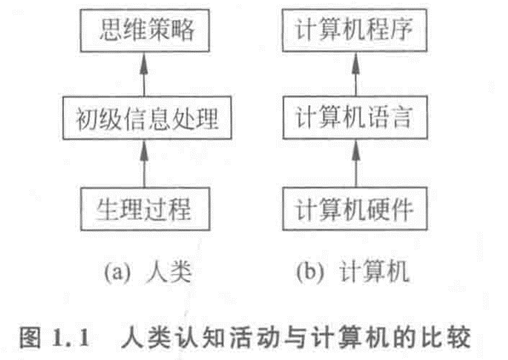

### 信息处理系统/符号操作系统/物理符号系统

具有智能信息处理能力的自动控制系统

### 符号系统6种基本功能

1. 输入符号
2. 输出符号
3. 存储符号
4. 复制符号
5. 建立符号结构
6. 条件性迁移

### 假设/假说

系统智能，必定具备上述6种功能；系统具有上述6中功能，能够表现出智能

### 三个推论

1. 人具备智能，是物理符号系统
2. 计算机是物理符号系统，能够表现出智能
3. 人是物理符号系统，计算机是物理符号系统，那么能用计算机模拟人

### 人类智能的计算机模拟

* 机器智能可以模拟人类智能
* 智能计算机
  * 下棋
  * 定理证明
  * 语言翻译
* 新型智能计算机
  * 神经计算机
  * 量子计算机

### 人工智能的要素

知识、数据、算法、算力、人才

## 人工智能系统分类

1. 专家系统
2. 模糊系统
3. 神经网络系统
4. 机器学习系统
5. 仿生进化系统
6. 群体智能系统
7. 分布式智能系统
8. 集成智能系统
9. 自主智能系统
10. 人机协同智能系统

## 人工智能的研究目标

### 一般研究目标

* 理解人类智能

  通过编写程序来模仿和检验人类智能的有关理论，更好地理解人类智能。

* 实现人类智能

  创造有用的灵巧程序，执行一般需要人类专家才能实现的任务，实现人类智能。

### 近期研究目标

建造智能计算机代替人类的部分智力劳动。

### 远期研究目标

揭示人类智能的根本机理，用智能机器去模拟、延伸和扩展人类的智能。

> 近期目标为远期目标奠定了理论和技术基础，远期目标为近期目标指明了方向。

## 人工智能的研究内容（10个方面）

1. 认知建模
   浩斯顿将认知归纳为五种模型
2. 知识表示
   状态空间、问题归约、谓词逻辑
3. 知识推理
   演绎推理、归纳推理、类比推理
4. 计算智能
   神经计算、模糊计算、进化计算
5. 知识应用
   专家系统、机器学习、自动规划
6. 机器感知
   模式识别、自然语言处理
7. 机器思维
   综合知识表示、知识推理等
8. 机器学习
   机器自动获取知识和学习
9. 机器行为
   表达能力和行动能力
10. 智能系统构建
   分布式系统、并行处理系统

## 人工智能的研究方法

1. 功能模拟法
2. 结构模拟法
3. 行为模拟法
4. 集成模拟法

## 人工智能的计算方法

1. 概率计算
2. 符号规则逻辑运算
3. 模糊计算
4. 神经计算
5. 进化计算与免疫计算
6. 群智能优化计算、蚁群算法等

## 人工智能的研究与应用领域

### 传统研究领域（16个方面）

1. 问题求解与博弈
2. 逻辑推理与定理证明
3. 计算智能
4. 分布式人工智能与智能体
5. 自动程序设计
6. 专家系统
7. 机器学习
8. 自然语言理解
9. 机器人学
10. 模式识别
11. 机器视觉
12. 神经网络
13. 智能控制
14. 智能调度与指挥
15. 智能检索
16. 系统与语言工具

### 新产业领域（9个方面）

1. 智能制造
2. 智慧医疗
3. 智慧农业
4. 智能金融
5. 智能交通与智能驾驶
6. 智慧城市
7. 智能家居
8. 智能管理
9. 智能经济

## 习题

### 1-1 什么是人工智能？试从学科和能力两方面加以说明。

* 从学科角度来看：人工智能是计算机科学中涉及研究、设计和应用智能机器的一个分支。
  * 它的近期主要目标在于研究用机器来模仿和执行人脑的某些智能功能，并开发相关理论和技术。
* 从能力角度来看：人工智能是智能机器所执行的通常与人类智能有关的功能，如判断、推理、证明、识别、感知、理解、设计、思考、规划、学习和问题求解等思维活动

### 1-6 现在人工智能有哪些学派？它们的认知观是什么？

1. 符号主义(Symbolicism)/逻辑主义(Logicism)/心理学派(Psychlogism)/计算机学派(Computerism)

   > 其原理主要为物理符号系统(即符号操作系统)假设和有限合理性原理。

   * 认为人的认知基元是符号，而且认知过程即符号操作过程。
   * 认为人是一个物理符号系统，计算机也是一个物理符号系统，因此，我们就能够用计算机来模拟人的智能行为。
   * 认为知识是信息的一种形式，是构成智能的基础。
   * 认为人工智能的核心问题是知识表示、知识推理和知识运用。

2. 联结主义(Connectionism)/仿生学派(Bionicsism)/生理学派(Physiologism)

   > 其原理主要为神经网络及神经网络间的连接机制与学习算法

   * 认为人的思维基元是神经元，而不是符号处理过程。
   * 认为人脑不同于电脑，并提出联结主义的大脑工作模式，用于取代符号操作的电脑工作模式。

3. 行为主义(Actionism)/进化主义(Evolutionism)/控制论学派(Cyberneticsism)

   > 其原理为控制论及感知-动作型控制系统

   * 认为智能取决于感知和行动。
   * 认为智能不需要知识、不需要表示、不需要推理；人工智能可以像人类智能一样逐步进化。
   * 认为智能行为只能在现实世界中与周围环境交互作用而表现出来。
   * 认为符号主义、联结主义对真实世界客观事物的描述及其智能行为工作模式是过于简化的抽象，因而是不能真实地反映客观存在的。

### 1-11 人工智能的主要研究和应用领域是什么？其中，哪些是新的研究热点？

1. 主要研究和应用领域

   问题求解(下棋程序)，逻辑推理与定理证明(四色定理证明)，自然语言理解，自动程序设计，专家系统，机器学习，神经网络，机器人学(星际探索机器人)，模式识别(手写识别，汽车牌照识别，指纹识别)，机器视觉(机器装配，卫星图像处理)，智能控制，智能检索，智能调度与指挥(汽车运输高度，列车编组指挥)，系统与语言工具

2. 新的研究热点

   分布式人工智能与Agent，计算智能与进化计算，数据挖掘与知识发现(超市市场商品数据分析)，人工生命

# 第2章

## 知识表示（步骤）

> chatGPT-4

1. 概念化（Conceptualization）：这是知识表示的第一步，涉及将现实世界中的事物、概念和关系抽象成计算机可以理解的形式。在这个过程中，我们需要确定哪些概念和关系是重要的，以便在计算机中表示和处理它们。

2. 形式化（Formalization）：在概念化的基础上，形式化是将抽象的概念和关系转化为严格定义的数学或逻辑结构。这样可以确保知识表示的一致性和准确性，便于计算机进行推理和计算。常见的形式化表示方法包括谓词逻辑、一阶逻辑、描述逻辑等。

3. 模型化（Modeling）：模型化是将形式化的知识表示应用于实际问题和场景中，构建具体的知识模型。这些模型可以是基于规则的专家系统、基于本体的知识图谱、基于概率的贝叶斯网络等。模型化的过程需要考虑如何有效地存储、检索和更新知识，以及如何利用这些知识进行推理和决策。

## 状态空间表示

### 状态（state）

描述某类不同事物间的差别而引入的一组最少变量q~0~，q~1~，…，q~n~的有序集合。

### 操作符/算符（operator）/算子

使问题从一种状态变化为另一种状态的手段

### 状态空间（S, F, G）

#### 定义

* 是一个表示该问题全部可能状态及其关系的图
  * S：初始状态集合
  * F：操作符/操作序列集合
  * G：目标状态集合

#### 状态图/状态空间图

初始状态可达到的各种状态对应的节点组成的图

### 举例：15 Puzzle Problem (15数码难题)

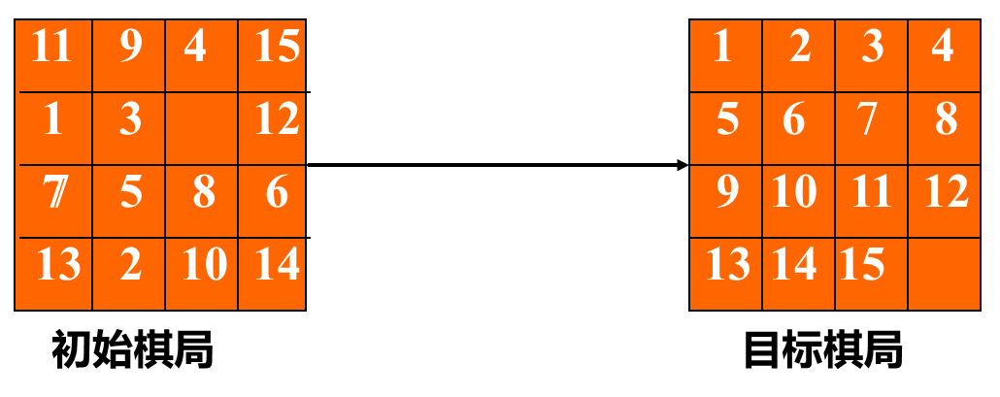

* 状态：棋局
* 算符
  * 15×4=60个
  * 移动空格4个
* 求解方法：从初始棋局开始，试探由每一合法走步得到的各种新棋局，然后计算再走一步而得到的下一组棋局。这样继续下去，直至达到目标棋局为止。这种尝试本质上涉及某种试探搜索。

### 状态图示法

#### 有向图

* 节点用弧线连接起来，从一个节点指向另一个节点。
* **父辈节点 / 祖先**->**后继节点 / 后裔**

#### 路径

节点序列（n~i1~，n~i2~，…, n~ik~），长度为k的路径

#### 代价

节点n~i~指向节点 n~j~这段弧线的代价c(n~i~, n~j~)，两节点路径的代价等于该路径上所有弧线代价之和。对于最优化问题，要找到两节点间具有最小代价的路径。

#### 显式图（图的显式说明）

各节点及其具有代价的弧线由一张表明确给出。不适用于大型图。

#### 隐式图（图的隐示说明）

节点的无限集合{s~i~}作为起始节点是已知的。后继节点算符Γ也是已知的，它能作用于任一节点以产生该节点的全部后继节点和各连接弧线的代价。

#### 例题

##### 例1 路线规划

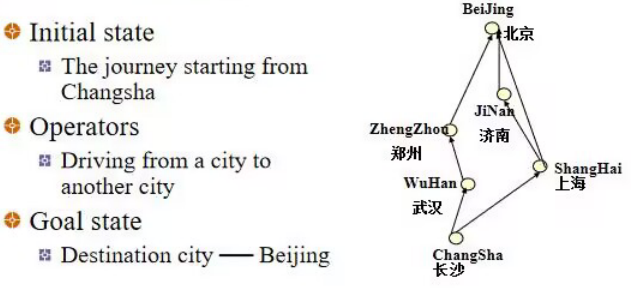

##### 例2 猴子和香蕉问题

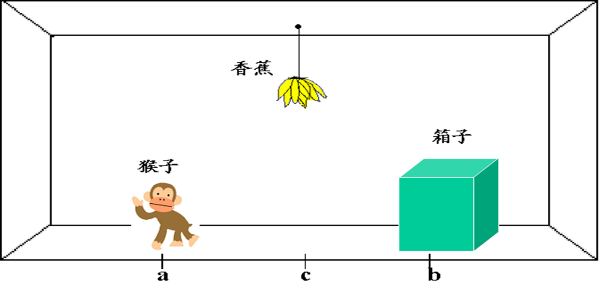

1. 状态

   用一个四元表列（W，x，Y，z）来表示这个问题状态

   * W：猴子的水平位置
   * x：当猴子在箱子顶上时取x=1；否则取x=0
   * Y：箱子的水平位置
   * z：当猴子摘到香蕉时取z=1；否则取z=0

2. 算符

   1. goto (U) ：表示猴子走到水平位置U

      $(W,0,Y,z) \dfrac{goto(U)}{} (W,0,Y,z)$

   2. pushbox (V) ：表示猴子把箱子推到水平位置V

      > 要应用算符pushbox（V），就要求规则的左边，猴子与箱子必须在同一位置上，并且，猴子不是箱子顶上。这种强加于操作的适用性条件，叫做产生式规则的先决条件。

      $(W,0,Y,z) \dfrac{pushbox(V)}{} (W,0,Y,z)$

   3. climbbox：猴子爬上箱顶

      $(W,0,Y,z) \dfrac{climbbox(V)}{} (W,1,Y,z)$

   4. grasp：表示猴子摘到香蕉

      $(c,1,Y,z) \dfrac{grasp}{} (c,1,c,1)$

3. 状态空间

   1. 初始状态集合 S

      {(*a*，0，*b*，0)}

   2. 操作序列集合 F

      {goto(b), pushbox(c), climbbox, grasp}

   3. 目标状态集合 G

      {(*c*，1，*c*，1)}

   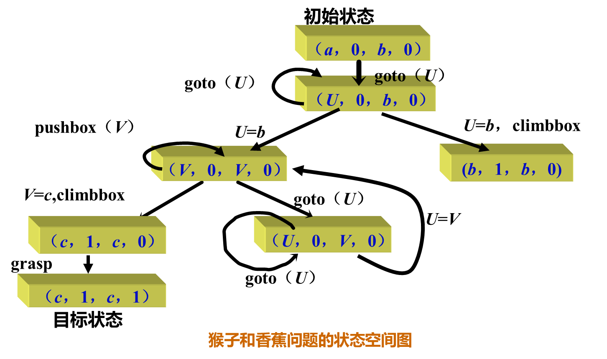

##### 例3 传教士野人问题★

设有3个传教士和3个野人来到河边，打算乘一只船从右岸渡到左岸去。该船的负载能力为两人。在任何时候，如果野人人数超过传教士人数，那么野人就会把传教士吃掉。他们怎样才能用这条船安全地把所有人都渡过河去？（方法不唯一）

###### 方法一

1. 状态

   用一个三元表列(N~x~,N~y~,C)来表示修道士和野人在河的左岸的状态

   * N~x~表示修道士在左岸的实际人数
   * N~y~表示野人在左岸的实际人数
   * C用来指示船是否在左岸
     * C=1表示在左岸
     * C=0表示在右岸

2. 算符

   1. L(i,j)：表示把i个修道士和j个野人从左岸运输到右岸
   2. R(i,j)：表示把i个修道士和j个野人从右岸运输到左岸

   > 约束：i+j <= 2，N~x~ >= N~y~ 

3. 状态空间

   1. 初始状态集合 S

      {(3，3，1)}

   2. 操作序列集合 F

      {L(1,0)，L(2,0)，L(1,1)，L(0,1)，L(0,2)，R(1,0)，R(2,0)，R(1,1)，R(0,1)，R(0,2)}

   3. 目标状态集合 G

      {(0，0，0)}

4. 求解

   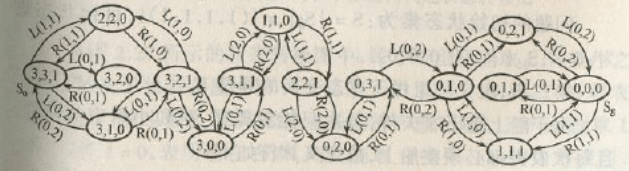

   * 从图中可看出四种不同路径，总共有四种答案。
   * 其中：L(1,1)，R(1,0)，L(0,2)，R(0,1)，L(2,0)，R(1,1)，L(2,0)，R(0,1)，L(0,2)，R(0,1)，L(0,2)是算符最少的解之一

###### 方法二

1. 状态

   用S~i~(nC, nY) 表示第 i 次渡河后，河对岸的状态

   * nC 表示传教士的数目
   * nY 表示野人的数目

2. 算符

   用d~i~(dC, dY)表示渡河过程中，对岸状态的变化

   * dC 表示，第i 次渡河后，对岸传教士数目的变化
   * dY 表示，第i 次渡河后，对岸野人数目的变化。

   > 约束：
   >
   > 1. i 为偶数时，dC, dY 同时为非负数，表示船驶向对岸
   > 2. i 为奇数时，dC, dY 同时为非正数，表示船驶回岸边。

3. 状态空间

   1. 初始状态集合 S

      {(0，0)}

   2. 操作序列集合 F

      {...}

   3. 目标状态集合 G

      {(3，3)}

4. 求解

   

   * 用图求法该问题，令横坐标为nY, 纵坐标为nC，可行状态为空心点表示，每次可以在格子上，沿对角线移动一格，也可以沿坐标轴方向移动1 格，或沿坐标轴方向移动2 格。

   * 约束

     * 第奇数次数状态转移，沿右方，上方，或右上方移动，
     * 第偶数次数状态转移，沿左方，下方，或左下方移动。

   * 从(0,0)开始，依次沿箭头方向改变状态，经过11 步之后，即可以到达目标状态(3,3)，

   * 相应的渡河方案为

     d1(1,1) -> d2(-1,0)-> d3(0,2)-> d4(0,-1)-> d5(2,0)-> d6(-1,-1)-> d7(2,0)-> d8(0,-1)-> d9(0,2)-> d10(-1,0) -> d11(1,1)

## 问题归约表示

基于状态空间

### 与状态空间表示的关系

#### PPT

1. 状态空间法是一种基于解答空间的问题表示和求解方法，它是以状态和操作符为基础的。在利用状态空间图表示时,从某个初始状态开始,每次加一个操作符,递增地建立起操作符的试验序列,直到达到目标状态为止.由于状态空间法需要扩展过多的节点,容易出现“组合爆炸”,因而只适用于表示比较简单的问题。
2. 问题归约法从目标（要解决的问题）出发,逆向推理,通过一系列变换把初始问题变换为子问题集合和子子问题集合,直至最后归约为一个平凡的本原问题集合.这些本原问题的解可以直接得到,从而解决了初始问题,用与或图来有效地说明问题归约法的求解途径。
3. 状态空间法是问题归约法的一种特例。在问题归约法的与或图中,包含有与节点和或节点，而在状态空间法中只含有或节点。

#### chatGPT-4

1. 目的：两者都是为了解决问题或实现目标。
   1. 问题归约表示关注于将一个复杂问题分解为若干个简单的子问题，然后通过解决这些子问题来解决原问题。

   2. 状态空间表示则关注于描述问题的所有可能状态以及从一个状态转移到另一个状态的规则，从而找到从初始状态到目标状态的路径。

2. 表示方法
   1. 问题归约表示通常使用树形结构来表示问题的分解过程，每个节点表示一个子问题，边表示子问题之间的关系。

   2. 状态空间表示使用图形结构来表示问题的所有可能状态，节点表示状态，边表示状态之间的转换。

3. 求解策略
   1. 问题归约表示通常采用自顶向下的求解策略，从原问题开始，逐步分解为子问题，直到子问题可以直接解决。

   2. 状态空间表示通常采用搜索算法（如深度优先搜索、广度优先搜索、A*搜索等）来在状态空间中寻找从初始状态到目标状态的路径。

4. 适用场景
   1. 问题归约表示适用于可以分解为相互独立或相对简单的子问题的问题，如排序、最短路径等。
   2. 状态空间表示适用于需要在大量可能状态中寻找解决方案的问题，如八皇后问题、旅行商问题等。

### 实质

从目标(要解决的问题)出发逆向推理，建立子问题以及子问题的子问题，直至最后把初始问题归约为一个平凡的本原问题集合。

### 梵塔难题(Tower of Hanoi Puzzle)

#### 状态空间法

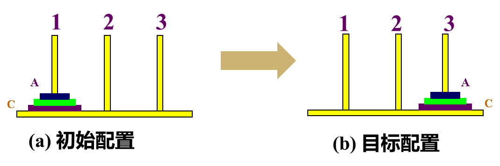

#### 问题规约法

* 把原始梵塔难题归约（简化）为下列3个子难题

* (ABC)的含义：

  |                  | C    | B    | A    |
  | ---------------- | ---- | ---- | ---- |
  | 圆盘在哪个柱子上 |      |      |      |

  

* 解题过程（3个圆盘梵塔难题）

  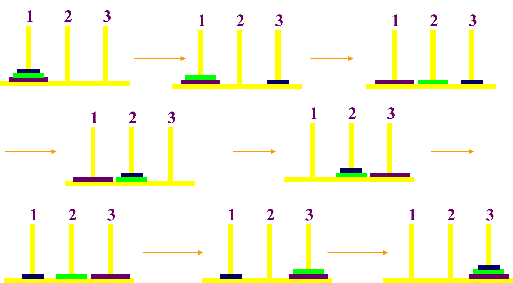

* 梵塔问题归约图（与或图）

  

### 相关术语

#### 与或图/问题归约图/与或树

##### 定义

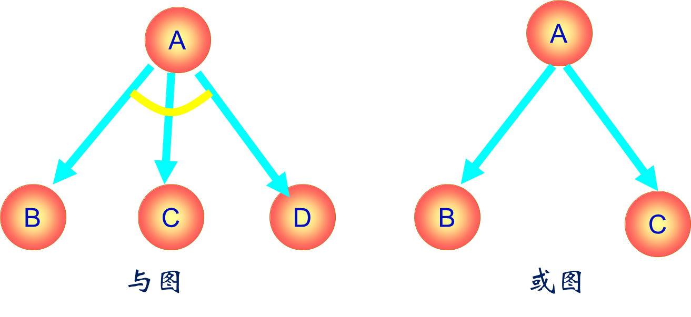

* 用一个似图结构来表示把问题归约为后继问题的替换集合
* 由与节点及或节点组成的结构图。
* 各个**与节点**用跨接指向他们后继节点的弧线的小段圆弧加以标记

##### 与或图构成规则

* 与或图中的每个节点代表一个要解决的单一问题或问题集合。

  起始节点对应于原始问题。终叶节点对应于本原问题的节点。

* 对于把算符应用于问题A的**每种可能情况**，都把问题变换为一个子问题集合；有向弧线自A指向后继节点，表示所求得的子问题集合，这些子问题节点叫做**或**节点。

* 一般对于代表**两个或两个以上子问题集合**的每个节点，有向弧线从此节点指向此子问题集合中的各个节点,这些子问题节点叫做**与**节点。

#### 起始节点

对于于原始问题描述的节点

#### 终叶节点

对应于本原问题的节点

#### 或节点

只要解决某个问题就可解决其父辈问题的节点集合，如（M，N，H）。

#### 与节点

只有解决所有子问题，才能解决其父辈问题的节点集合，如（B，C）和（D，E，F）。各个节点之间用一段小圆弧连接标记。

#### 可解节点

* 终叶节点是可解节点(因为它们与本原问题相关联)。
* 如果某个非终叶节点含有**或**后继节点，那么**只要有一个**后继节点是**可解**的时，此非终叶节点就是可解的。
* 如果某个非终叶节点含有**与**后继节点，那么只有其**全部**后继节点为**可解**时，此非终叶节点才是可解的。

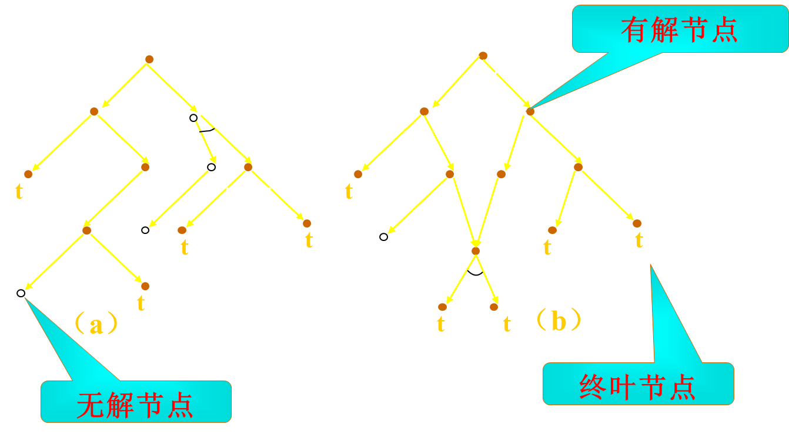

> 实心节点有解，空心节点无解；标了t的节点是终叶节点，没有标的是非终叶节点。

#### 不可解节点

* **没有后裔的非终叶节点**为不可解节点。
* 如果某个非终叶节点含有**或**后继节点，那么只有当其**全部**后裔为**不可解**时，此非终叶节点才是不可解的。
* 如果某个非终叶节点含有**与**后继节点，那么只要当其后裔有**一个**为**不可解**时，此非终叶节点就是不可解的。

## 谓词逻辑表示

### 组成

1. 谓词符号
2. 变量符号
3. 函数符号
4. 常量符号

### 一阶谓词逻辑

#### 谓词符号

##### 定义

* 思维对象（个体）的属性或个体之间的关系的符号。
* 用大写字母或大写字母串表示。如：P，Q，LIKE，ON

##### 谓词形式

P(x1,x2,x3,…,xn)

#### 原子公式

谓词符号+项

#### 项

常量、变量

#### 函数符号

##### 定义

若干思维对象到某个思维对象的映射符号。用小写字母或小写字母串表示。如f,g等。

##### 函数形式

f(x1,x2,x3,…,xn)

#### 连接词

\~：否定（非）\~P

∧：合取（与）PQ

∨：析取（或）PQ

→：蕴涵P→Q(if P then Q）

↔：等价P↔Q

#### 量词

说明个体变量的范围

$\exists$（全称量词）：“所有的”、“任意的”、“一切”、“每一个”

$\forall $（存在量词）：“有些”、“至少一个”、“存在”

#### 谓词公式

##### 原子公式/原子谓词公式

用P(x1，x2，…，xn)表示一个n元谓词公式，其中P为n元谓词，x1，x2，…，xn为客体变量或变元。通常把P(x1，x2，…，xn)叫做谓词演算的**原子公式**，或**原子谓词公式**。

##### 分子谓词公式

可以用**连词**把原子谓词公式组成**复合谓词公式**，并把它叫做分子谓词公式。

##### 合式公式

###### 递归定义

* 原子谓词公式是合式公式。
* 若A为合式公式，则～A也是一个合式公式。
* 若A和B都是合式公式，则(A∧B)，(A∨B)，(A → B)和(A←→B)也都是合式公式。
* 若A是合式公式，x为A中的自由变元，则(∀ x)A和(ョ x)A都是合式公式。
* 只有按上述规则求得的那些公式，才是合式公式。

###### 真值表

###### 性质

###### 等价

如果两个合式公式，无论如何解释，其真值表都是相同的，那么我们就称此两合式公式是等价的。

##### 永真式

所有可能的解释下，P均为真（T）

##### 永假式（不可满足的）

所有可能的解释下，P均为假（F）

##### 可满足的

仅在某一特定的解释下，P为真。

### 置换与合一

#### 假元推理

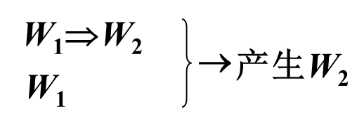

由合式公式 W~1~ 和 W~1~ $\Rightarrow$ W~2~ 产生合式公式 W~2~ 

#### 全称化推理

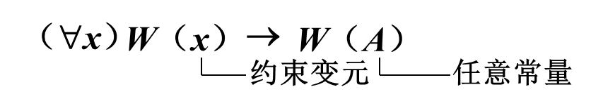

#### 综合推理

#### 置换

##### 定义

在表达式中用置换项置换变量。如果用*E*表示表达式，*s*为一置换，则置换后的表达式记为*Es*。

##### 举例

##### 性质

* 可结合律
  * （Ls1）s2=L（s1s2）
  * （s1s2）s3=s1（s2s3）
* 不可交换律：s1s2 ≠ s2s1

#### 合一

##### 合一定义

* 寻找项对变量的置换，以使两表达式一致。

> 如果一个置换s作用于表达式集{E i}的每个元素，则我们用{E i} s来表示置换例的集。

##### 可合一

称表达式集{E i}是可合一的，如果存在一个置换s使得：

$E 1 s = E 2 s = E 3 s =…$

s称为{E i}的合一者。

##### 举例

##### mgu

最通用的合一者：如果对表达式集{E~i~}的任一合一者s，都存在某一s’，使得{E~i~}s ＝ {E~i~}gs’，则称g为{E~i~}的最通用合一者，记为mgu 。

> g={B/y}是上例中{P[x,f(y),B], P[x,f(B),B]}最简单的合一者

# 第2章

• 语义网络表示
– 知识的结构化图解表示、节点（实体/概念/情况）、弧
线/链线（节点间关系）
– 二元语义网络、多元语义网络（二元关系的合取、附
加节点）
– 推理过程：继承（值继承/”如果需要”继承/”缺省”继
承）、匹配（几部分组成的事物）
– 举例：
• 小燕从春天到秋天占有一个巢
• John给Mary一个礼物
7
第2章
– 举例：
• Use semantic networks to represent the followings:
– Nellie is an elephant,
– he likes apples. 
– Elephants are a kind of mammals,
– they live in Africa, 
– and they are big animals. 
– Mammals and reptiles are both animals, 
– all animals have head.
• 框架表示、本体技术、过程表示
8
第3章
• 求解：初始状态目标状态
• 图搜索策略
– 无信息搜索、启发式搜索
– OPEN表、CLOSED表、指向父节点的指针、代价
– 图搜索(GRAPHSEARCH)的一般过程
• 盲目搜索
– 宽度优先搜索：OPEN表是队列
– 深度优先搜索：OPEN表是栈、深度界限
– 等代价搜索：需要计算代价、区分代价与长度
9
第3章
• 启发式搜索
– 估价函数f(x)=g(x)+h(x)
– 有序搜索/最佳优先搜索：启发式搜索的一般策略
– 贪婪算法(Greedy Search)：f(x)=h(x)
– 等代价搜索UCS：f(x)=g(x)
– A算法：f(x)=g(x)+h(x)
– A*算法：f(x)=g(x)+h(x)，g(x)>0，h(x)≤h*(x)
• 八数码难题（h1(x)=错放棋子数；h2(x)=曼哈顿距离）
• OPEN表、CLOSED表中的节点
• 最优解
10
第3章
• 消解原理/归结原理
– 文字、子句
– 子句集的求取（9个步骤）
– 推理：消去互补对、消解式
– 含有变量的消解式：置换
– 消解反演：类似反证法~L、空子句NIL
• 例1：设事实的公式集合{…}，证明：R
• Example2: Happy student
• 例3: 储蓄问题（例3.9）
– 反演求解：~L∨L、回答子句
11
第3章
• 规则演绎系统
– 基于Ifthen规则的为题求解
– 规则正向演绎系统
• 正向推理
• 事实表达式的与或形变换
• 事实表达式的与或图表示：析取带弧
• 与或图的F规则变换：LW，消去量词、应用于与或图
• 作为终止条件的目标公式：文字析取形式
12
第3章
– 规则逆向演绎系统
• 逆向推理
• 目标表达式的与或形式：与或图表示合取带弧
• 与或图的B规则变换：WL，W为文字的合取形
• 作为终止条件的事实节点的一致解图
– 规则双向演绎系统
• 双向推理
• 组合演绎系统
– 不确定性推理、概率推理、主观贝叶斯方法
13
第4章
• AI vs. CI
– 非数值方式+知识、数值数据
– ABC交互关系
• 神经计算
– 研究进展：MP模型、感知器、BP算法；ANN的特性
– 人工神经网络的结构
• 神经元：输入、权重、偏置（阈值）、变换函数（激励函数）
输出
• 两类结构：递归（反馈）网络、前馈网络
• 学习算法：有师学习、无师学习、增强学习
– 人工神经网络示例及其算法
14
第4章
– 基于神经网络的知识表示与推理
• 与运算、或运算、非、异或
• 邻接矩阵、阈值向量
• 知识获取、知识库、泛化能力
• 模糊计算
• 进化算法与遗传算法
– 新思想：不是一开始就找最优的解
– 进化计算：遗传算法、进化策略、进化编程、遗传编程
– 基于种群的优化方法（优于梯度优化方法）
15
第4章
– 遗传算法
• 编码与解码：二进制串长度、搜索精度、基因型、表现型
• 适应度
• 遗传算子
– 选择：赌轮选择、联赛选择
– 交叉（pc）：单点交叉、两点/多点交叉、均匀交叉
– 变异（pm）
• 精英策略
• 执行实例、习题4-14
• 人工生命
16
第4章
• 群智能优化算法
– 粒群优化算法PSO
• 每只鸟抽象为一个无质量，无体积的“粒子”
• 邻域
• 每一次单位时间的飞行后，所有粒子分享信息，下一步将飞向
自身最佳位置和全局或邻域最优位置的加权中心
• 每次迭代中，粒子通过跟踪“个体极值”和“全局极值”来更
新自己的位置
– 蚁群优化算法ACO
• 基于蚂蚁寻找食物时的最优路径选择问题
• 把具有简单功能的工作单元看作蚂蚁
• 优先选择信息素浓度大的路径
17
第6章
• 机器学习的定义
• 发展史
– 热烈时期、冷静时期、复兴时期、最新阶段
• 主要策略
– 推理：机械学习、示教学习、类比学习、示例学习
– 统计：有监督学习、无监督学习、半监督学习、增强
学习
• 基本结构
– 推理：环境、学习、知识库、执行
– 统计：学习模型、历史数据、新数据、未知属性
18
第6章
• 归纳学习
– 学习模式：F、H、背景知识
– 概况规则（5条）
– 学习方法：示例学习/实例学习、观察发现学习
• 决策树学习
– 决策、决策树
– 构造算法CLS
– 学习算法ID3：熵、信息增益
• 类比学习
– 推理过程：回忆与联想、选择、建立对应关系、转换
– 类比学习：（四个过程）
– 研究类型：问题求解型、预测推定型
19
第6章
• 解释学习
– EBG：目标概念TC、训练实例TE、领域知识、操作准则
– 两个步骤：解释、概括（一般化）
– 逆向推理：解释证明树
• 神经网络学习
– 两大学派：化学学派、突触修正学派
– 学习方法：有师学习、无师学习、增强学习
– 感知器学习：权值调整规则
– Hebb Learning Rule：权值、偏置的调整、
• 举例：训练与门、识别M和L、
20
第6章
– 基于反向传播网络的学习
• BP算法思想
• 权值修正公式
• BP算法
• 举例：药品销量预测、人脸识别
– 基于Hopfield网络学习
• 知识发现
– KDD
– 定义
– 处理过程：数据选择、数据预处理、数据变换、数据挖掘、
知识评价（知识发现与数据挖掘的关系）
– 方法：统计、机器学习、神经计算、可视化
– 应用（8个方面）
21
第6章
• 增强学习
– 学习自动机
– 自适应动态程序设计（时差学习）
– Q学习（Q-值代替效用值）
• 深度学习
– 定义与特点
– 分布式表示、人工神经网络
– 模型：卷积神经网络、循环神经网络、受限玻耳兹曼
机、自动编码器、深度信念网络
– 应用：机器博弈、计算机视觉、语音识别、机器人…
