# 前言

1. ★大概率考
2. ✦个人推测考点
3. ※补充内容
4. 没有完全覆盖“人工智能导论复习2023.pdf”的重点
5. 致谢：[hwl](https://william3242.github.io/2023/04/29/%E4%BA%BA%E5%B7%A5%E6%99%BA%E8%83%BD%E5%AF%BC%E8%AE%BA%E5%A4%8D%E4%B9%A0%E6%8C%87%E5%8D%97/)、lyf、lqx

# 题型

1. 问答：5*10分
2. 综合：15分
3. 设计：25分
4. 开放题/论述题：10分

# 第1章 绪论

## 人工智能的定义

### 智能

* 思考与理解能力
* 智能是一种**应用知识处理环境**的能力或由目标准则衡量的**抽象思考**能力

### 智能机器

* 一种能够**呈现出人类智能行为**的机器

  > 智能行为：人类用大脑考虑问题或创造思想

* 一种能在**不确定**环境中执行**各种拟人任务**并**达到预期目标**的机器

### 人工智能（学科）✦

* 人工智能（学科）是计算机科学中涉及**研究、设计和应用智能机器**的一个**分支**。
* 近期主要目标在于研究用机器来**模仿和执行人脑的某些智力功能**，并开发相关理论和技术。

### 人工智能（能力）✦

人工智能（能力）是智能机器所执行的通常**与人类智能有关的智能行为**，如判断、推理、证明、识别、感知、理解、通信、设计、思考、规划、学习和问题求解等思维活动。

## 人工智能的发展

### 国际

1. 孕育时期（-1956）
2. 形成时期（1956-1970）
3. 暗淡时期（1966-1974）
4. 知识应用时期（1970-1988）
5. 集成发展时期（1986-2010）
6. 融合发展时期（2011-）

### 中国

1. 迷雾重重
2. 艰难起步
3. 迎来曙光
4. 蓬勃发展
5. 国家战略

## 人工智能的各种认知观

### 对比✦

|                  | 符号主义                             | 连接主义                               | 行为主义                        |
| ---------------- | ------------------------------------ | -------------------------------------- | ------------------------------- |
| 认为人工智能源于 | 数理逻辑                             | 仿生学                                 | 控制论                          |
| 原理             | 基于物理符号系统假设和有限合理性原理 | 基于神经网络及其间的连接机制与学习算法 | 基于控制论及感知—动作型控制系统 |
| 基本单元         | 符号                                 | 神经元                                 | （取决于）感知和行动            |
| 研究方法         | 功能模拟法                           | 结构模拟法                             | 行为模拟法                      |

### 符号主义/逻辑主义/心理学派

> 传统人工智能

认为人工智能源于数理逻辑。

#### 原理

基于物理符号系统假设和有限合理性原理

#### 基本单元

符号

#### 研究方法

功能模拟法

### 连接主义/仿生学派/生理学派

认为人工智能源于仿生学。

#### 原理

基于神经网络及其间的连接机制与学习算法

#### 基本单元

神经元

#### 研究方法

结构模拟法

### 行为主义/进化主义/控制论学派

认为人工智能源于控制论。

#### 原理

基于控制论及感知—动作型控制系统

#### 基本单元（取决于）

感知和行动

#### 研究方法

行为模拟法

### 关系

长期共存于与合作，取长补短，并走向融合和集成，为人工智能的发展做出贡献

## 人类智能与人工智能

### 认知过程

### 信息处理系统/符号操作系统/物理符号系统

具有智能信息处理能力的自动控制系统

### 符号系统6种基本功能

1. 输入符号
2. 输出符号
3. 存储符号
4. 复制符号
5. 建立符号结构
6. 条件性迁移

### 假设/假说

> 系统智能 ⇔上述6种功能

* 系统智能，必定具备上述6种功能；
* 系统具有上述6种功能，能够表现出智能

### 三个推论

1. 人具备智能，是物理符号系统
2. 计算机是物理符号系统，能够表现出智能
3. 人是物理符号系统，计算机是物理符号系统，那么能用计算机模拟人

### 人类智能的计算机模拟

* 机器智能可以模拟人类智能
* 智能计算机
  * 下棋
  * 定理证明
  * 语言翻译
* 新型智能计算机
  * 神经计算机
  * 量子计算机

### 人工智能的要素

1. **知识**是人工智能之源
2. **数据**是人工智能之基
3. **算法**是人工智能之魂
4. **算力**是人工智能之力
5. **人才**是人工智能发展的关键

## 人工智能系统分类

1. 专家系统
2. 模糊系统
3. 神经网络系统
4. 机器学习系统
5. 仿生进化系统
6. 群体智能系统
7. 分布式智能系统
8. 集成智能系统
9. 自主智能系统
10. 人机协同智能系统

## 人工智能的研究目标

### 一般研究目标

* 理解人类智能

  通过编写程序来模仿和检验人类智能的有关理论，更好地理解人类智能。

* 实现人类智能

  创造有用的灵巧程序，执行一般需要人类专家才能实现的任务，实现人类智能。

### 近期研究目标

建造智能计算机代替人类的部分智力劳动。

### 远期研究目标

揭示人类智能的根本机理，用智能机器去模拟、延伸和扩展人类的智能。

> 近期目标为远期目标奠定了理论和技术基础，远期目标为近期目标指明了方向。

## 人工智能的研究内容

1. 认知建模
   浩斯顿将认知归纳为五种模型
2. 知识表示
   状态空间、问题归约、谓词逻辑
3. 知识推理
   演绎推理、归纳推理、类比推理
4. 计算智能
   神经计算、模糊计算、进化计算
5. 知识应用
   专家系统、机器学习、自动规划
6. 机器感知
   模式识别、自然语言处理
7. 机器思维
   综合知识表示、知识推理等
8. 机器学习
   机器自动获取知识和学习
9. 机器行为
   表达能力和行动能力
10. 智能系统构建
   分布式系统、并行处理系统

## 人工智能的研究方法

1. 功能模拟法
2. 结构模拟法
3. 行为模拟法
4. 集成模拟法

## 人工智能的计算方法

1. 概率计算
2. 符号规则逻辑运算
3. 模糊计算
4. 神经计算
5. 进化计算与免疫计算
6. 群智能优化计算、蚁群算法等

## 人工智能的研究与应用领域

### 传统研究领域（16个方面）

1. 问题求解与博弈
2. 逻辑推理与定理证明
3. 计算智能
4. 分布式人工智能与智能体
5. 自动程序设计
6. 专家系统
7. 机器学习
8. 自然语言理解
9. 机器人学
10. 模式识别
11. 机器视觉
12. 神经网络
13. 智能控制
14. 智能调度与指挥
15. 智能检索
16. 系统与语言工具

### 新产业领域（9个方面）

1. 智能制造
2. 智慧医疗
3. 智慧农业
4. 智能金融
5. 智能交通与智能驾驶
6. 智慧城市
7. 智能家居
8. 智能管理
9. 智能经济

## 习题

###  1-1 什么是人工智能？试从学科和能力两方面加以说明。

* 从[学科角度](#人工智能（学科）✦)
* 从[能力角度](#人工智能（能力）✦)

###  1-5 为什么能够用机器(计算机)模仿人的智能?※

1. [符号系统6种基本功能](#符号系统6种基本功能)
1. [假设/假说](#假设/假说)
1. [三个推论](#三个推论)

### 1-6 现在[人工智能有哪些学派](#人工智能的各种认知观)？它们的认知观是什么？

1. 符号主义(Symbolicism)/逻辑主义(Logicism)/心理学派(Psychlogism)/计算机学派(Computerism)

   > 其原理主要为物理符号系统(即符号操作系统)假设和有限合理性原理。

   * 认为人的认知基元是符号，而且认知过程即符号操作过程。
   * 认为人是一个物理符号系统，计算机也是一个物理符号系统，因此，我们就能够用计算机来模拟人的智能行为。
   * 认为知识是信息的一种形式，是构成智能的基础。
   * 认为人工智能的核心问题是知识表示、知识推理和知识运用。

2. 连接主义(Connectionism)/仿生学派(Bionicsism)/生理学派(Physiologism)

   > 其原理主要为神经网络及神经网络间的连接机制与学习算法

   * 认为人的思维基元是神经元，而不是符号处理过程。
   * 认为人脑不同于电脑，并提出连接主义的大脑工作模式，用于取代符号操作的电脑工作模式。

3. 行为主义(Actionism)/进化主义(Evolutionism)/控制论学派(Cyberneticsism)

   > 其原理为控制论及感知-动作型控制系统

   * 认为智能取决于感知和行动。
   * 认为智能不需要知识、不需要表示、不需要推理；人工智能可以像人类智能一样逐步进化。
   * 认为智能行为只能在现实世界中与周围环境交互作用而表现出来。
   * 认为符号主义、连接主义对真实世界客观事物的描述及其智能行为工作模式是过于简化的抽象，因而是不能真实地反映客观存在的。

### 1-11 人工智能的主要研究和应用领域是什么？其中，哪些是新的研究热点？

1. [主要研究和应用领域](#人工智能的研究与应用领域)

   问题求解(下棋程序)，逻辑推理与定理证明(四色定理证明)，自然语言理解，自动程序设计，专家系统，机器学习，神经网络，机器人学(星际探索机器人)，模式识别(手写识别，汽车牌照识别，指纹识别)，机器视觉(机器装配，卫星图像处理)，智能控制，智能检索，智能调度与指挥(汽车运输高度，列车编组指挥)，系统与语言工具

2. 新的[研究热点](#研究热点)

   分布式人工智能与Agent，计算智能与进化计算，数据挖掘与知识发现(超市市场商品数据分析)，人工生命

# 第2章 知识表示方法

## 知识表示（步骤）

> chatGPT-4

1. 概念化（Conceptualization）：这是知识表示的第一步，涉及将现实世界中的事物、概念和关系抽象成计算机可以理解的形式。在这个过程中，我们需要确定哪些概念和关系是重要的，以便在计算机中表示和处理它们。

2. 形式化（Formalization）：在概念化的基础上，形式化是将抽象的概念和关系转化为严格定义的数学或逻辑结构。这样可以确保知识表示的一致性和准确性，便于计算机进行推理和计算。常见的形式化表示方法包括谓词逻辑、一阶逻辑、描述逻辑等。

3. 模型化（Modeling）：模型化是将形式化的知识表示应用于实际问题和场景中，构建具体的知识模型。这些模型可以是基于规则的专家系统、基于本体的知识图谱、基于概率的贝叶斯网络等。模型化的过程需要考虑如何有效地存储、检索和更新知识，以及如何利用这些知识进行推理和决策。

## 状态空间表示

### 状态（state）

描述某类不同事物间的差别而引入的一组最少变量q~0~，q~1~，…，q~n~的有序集合。

### 操作符/算符（operator）/算子

使问题从一种状态变化为另一种状态的手段

### 状态空间（S, F, G）

#### 定义

* 是一个表示该问题全部可能状态及其关系的图
  * S：初始状态集合
  * F：操作符/操作序列集合
  * G：目标状态集合

#### 状态图/状态空间图

初始状态可达到的各种状态对应的节点组成的图

### 举例：15 Puzzle Problem (15数码难题)

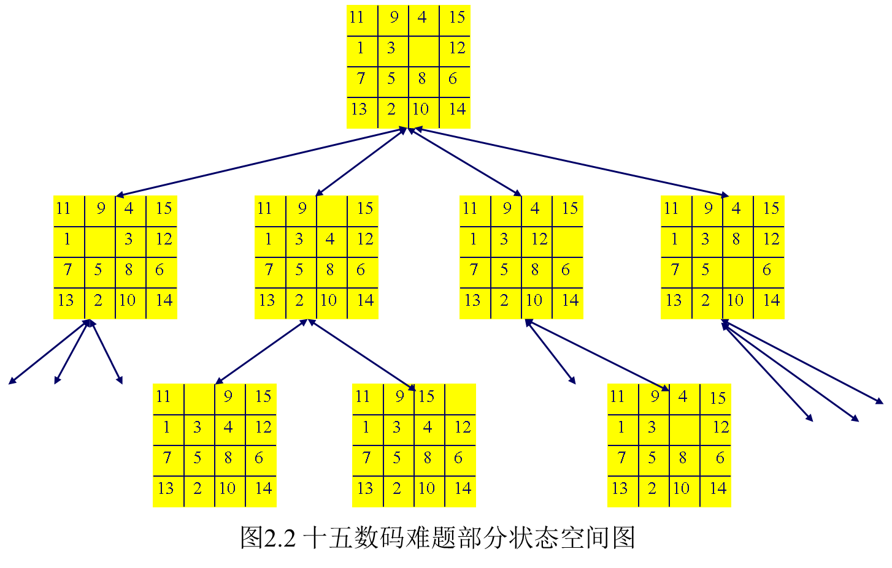

* 状态：棋局
* 算符
  * 15×4=60个
  * 移动空格4个
* 求解方法：从初始棋局开始，试探由每一合法走步得到的各种新棋局，然后计算再走一步而得到的下一组棋局。这样继续下去，直至达到目标棋局为止。这种尝试本质上涉及某种试探搜索。

### 状态图示法

#### 有向图

* 节点用弧线连接起来，从一个节点指向另一个节点。
* **父辈节点 / 祖先**->**后继节点 / 后裔**

#### 路径

节点序列（n~i1~，n~i2~，…, n~ik~），长度为k的路径

#### 代价

节点n~i~指向节点 n~j~这段弧线的代价c(n~i~, n~j~)，两节点路径的代价等于该路径上所有弧线代价之和。对于最优化问题，要找到两节点间具有最小代价的路径。

#### 显式图（图的显式说明）

各节点及其具有代价的弧线由一张表明确给出。不适用于大型图。

#### 隐式图（图的隐示说明）

节点的无限集合{s~i~}作为起始节点是已知的。后继节点算符Γ也是已知的，它能作用于任一节点以产生该节点的全部后继节点和各连接弧线的代价。

#### 例题

> 三选一

##### 例1 路线规划

##### 例2 猴子和香蕉问题✦

> 有略微修改

1. 状态

   用一个四元表列（W，x，Y，z）来表示这个问题状态

   * W：猴子的水平位置
   * x：当猴子在箱子顶上时取x=1；否则取x=0
   * Y：箱子的水平位置
   * z：当猴子摘到香蕉时取z=1；否则取z=0

2. 算符

   1. goto (U) ：表示猴子走到水平位置U

      $(W,0,Y,0) \dfrac{goto(U)}{} (U,0,Y,0)$

   2. pushbox (V) ：表示猴子把箱子推到水平位置V

      > 要应用算符pushbox（V），就要求规则的左边，猴子与箱子必须在同一位置上，并且，猴子不是箱子顶上。这种强加于操作的适用性条件，叫做产生式规则的**先决条件**。

      $(W,0,W,0) \dfrac{pushbox(V)}{} (V,0,V,0)$

   3. climbbox：猴子爬上箱顶

      $(W,0,W,0) \dfrac{climbbox}{} (W,1,W,0)$

   4. grasp：表示猴子摘到香蕉

      $(c,1,c,0) \dfrac{grasp}{} (c,1,c,1)$

3. 状态空间

   1. 初始状态集合 S

      {(*a*，0，*b*，0)}

   2. 操作序列集合 F

      {goto(a),goto(b),goto(c),pushbox(a),pushbox(b),pushbox(c),climbbox,grasp}

   3. 目标状态集合 G

      {(*c*，1，*c*，1)}

4. 求解

   > 总感觉这个图应该要展开画详细一点

   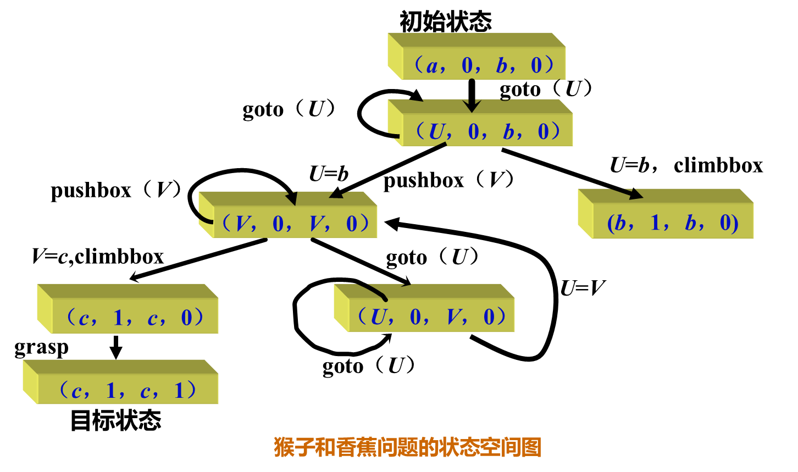

##### 例3 传教士野人问题★

设有3个传教士和3个野人来到河边，打算乘一只船从右岸渡到左岸去。该船的负载能力为两人。在任何时候，如果野人人数超过传教士人数，那么野人就会把传教士吃掉。他们怎样才能用这条船安全地把所有人都渡过河去？（方法不唯一）

###### 方法一

1. 状态

   用一个三元表列(N~x~,N~y~,C)来表示修道士和野人在河的右岸的状态

   * N~x~表示修道士在右岸的实际人数
   * N~y~表示野人在右岸的实际人数
   * C用来指示船是否在右岸
     * C=1表示在右岸
     * C=0表示在左岸

2. 算符

   1. L(i,j)：表示把i个修道士和j个野人从右岸运输到左岸
   2. R(i,j)：表示把i个修道士和j个野人从左岸运输到右岸

   > 约束：i+j <= 2，N~x~ >= N~y~， 3-N~x~ >= 3-N~y~ 

3. 状态空间

   1. 初始状态集合 S

      {(3，3，1)}

   2. 操作序列集合 F

      {L(1,0)，L(2,0)，L(1,1)，L(0,1)，L(0,2)，R(1,0)，R(2,0)，R(1,1)，R(0,1)，R(0,2)}

   3. 目标状态集合 G

      {(0，0，0)}

4. 求解

   

   * 从图中可看出四种不同路径，总共有四种答案。
   * 其中：L(1,1)，R(1,0)，L(0,2)，R(0,1)，L(2,0)，R(1,1)，L(2,0)，R(0,1)，L(0,2)，R(0,1)，L(0,2)是算符最少的解之一

###### 方法二

1. 状态

   用S~i~(nC, nY) 表示第 i 次渡河后，河对岸的状态

   * nC 表示传教士的数目
   * nY 表示野人的数目

2. 算符

   用d~i~(dC, dY)表示渡河过程中，对岸状态的变化

   * dC 表示，第i 次渡河后，对岸传教士数目的变化
   * dY 表示，第i 次渡河后，对岸野人数目的变化。

   > 约束：
   >
   > 1. i 为偶数时，dC, dY 同时为非负数，表示船驶向对岸
   > 2. i 为奇数时，dC, dY 同时为非正数，表示船驶回岸边。

3. 状态空间

   1. 初始状态集合 S

      {(0，0)}

   2. 操作序列集合 F

      {...}

   3. 目标状态集合 G

      {(3，3)}

4. 求解

   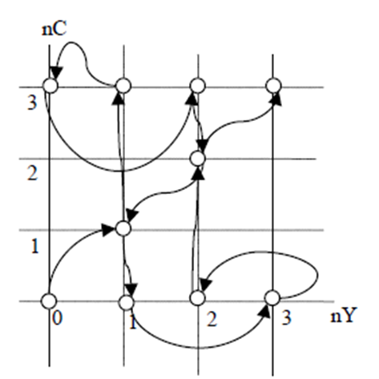

   * 用图求法该问题，令横坐标为nY, 纵坐标为nC，可行状态为空心点表示，每次可以在格子上，沿对角线移动一格，也可以沿坐标轴方向移动1 格，或沿坐标轴方向移动2 格。

   * 约束

     * 第奇数次数状态转移，沿右方，上方，或右上方移动，
     * 第偶数次数状态转移，沿左方，下方，或左下方移动。

   * 从(0,0)开始，依次沿箭头方向改变状态，经过11 步之后，即可以到达目标状态(3,3)，

   * 相应的渡河方案为

     d1(1,1) -> d2(-1,0)-> d3(0,2)-> d4(0,-1)-> d5(2,0)-> d6(-1,-1)-> d7(2,0)-> d8(0,-1)-> d9(0,2)-> d10(-1,0) -> d11(1,1)

## 问题归约表示

基于状态空间

### 与状态空间表示的关系

#### PPT

1. 状态空间法是一种基于解答空间的问题表示和求解方法，它是以状态和操作符为基础的。在利用状态空间图表示时,从某个初始状态开始,每次加一个操作符,递增地建立起操作符的试验序列,直到达到目标状态为止.由于**状态空间法**需要扩展过多的节点,容易出现“**组合爆炸**",因而只适用于表示比较简单的问题。
2. 问题归约法从目标（要解决的问题）出发,逆向推理,通过一系列变换把初始问题变换为子问题集合和子子问题集合,直至最后归约为一个平凡的本原问题集合.这些本原问题的解可以直接得到,从而解决了初始问题,用与或图来有效地说明问题归约法的求解途径。
3. 状态空间法是问题归约法的一种**特例**。在问题归约法的与或图中,包含有**与节点和或节点**，而在状态空间法中只含有**或节点**。

#### chatGPT-4

1. 目的：两者都是为了解决问题或实现目标。
   1. 问题归约表示关注于将一个复杂问题分解为若干个简单的子问题，然后通过解决这些子问题来解决原问题。

   2. 状态空间表示则关注于描述问题的所有可能状态以及从一个状态转移到另一个状态的规则，从而找到从初始状态到目标状态的路径。

2. 表示方法
   1. 问题归约表示通常使用树形结构来表示问题的分解过程，每个节点表示一个子问题，边表示子问题之间的关系。

   2. 状态空间表示使用图形结构来表示问题的所有可能状态，节点表示状态，边表示状态之间的转换。

3. 求解策略
   1. 问题归约表示通常采用自顶向下的求解策略，从原问题开始，逐步分解为子问题，直到子问题可以直接解决。

   2. 状态空间表示通常采用搜索算法（如深度优先搜索、广度优先搜索、A*搜索等）来在状态空间中寻找从初始状态到目标状态的路径。

4. 适用场景
   1. 问题归约表示适用于可以分解为相互独立或相对简单的子问题的问题，如排序、最短路径等。
   2. 状态空间表示适用于需要在大量可能状态中寻找解决方案的问题，如八皇后问题、旅行商问题等。

### 实质

从目标(要解决的问题)出发逆向推理，建立子问题以及子问题的子问题，直至最后把初始问题归约为一个平凡的本原问题集合。

### 梵塔难题(Tower of Hanoi Puzzle)

#### 状态空间法

#### 问题规约法

* 把原始梵塔难题归约（简化）为下列3个子难题

* (ABC)的含义：

  |                  | C    | B    | A    |
  | ---------------- | ---- | ---- | ---- |
  | 圆盘在哪个柱子上 |      |      |      |

  

* 解题过程（3个圆盘梵塔难题）

  

* 梵塔问题归约图（与或图）

  

### 相关术语

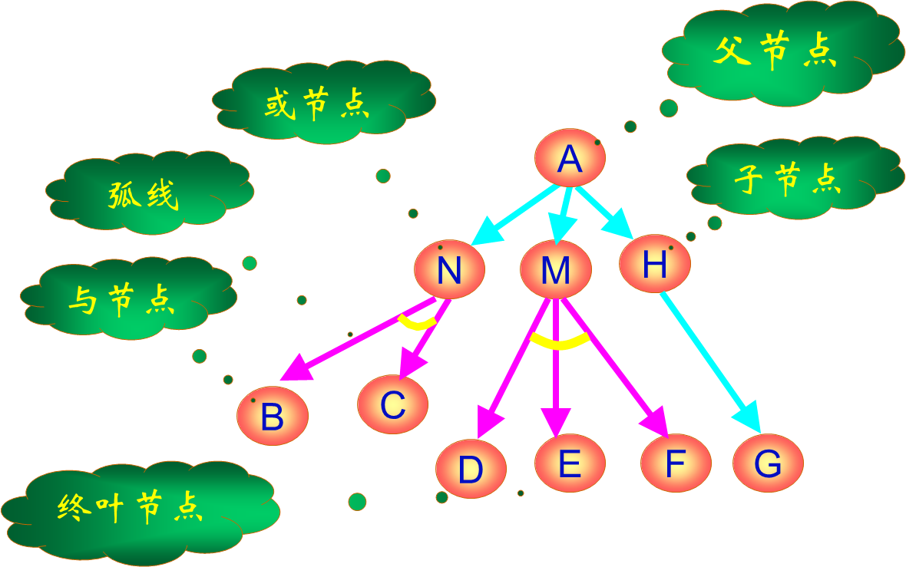

#### 与或图/问题归约图/与或树

##### 定义

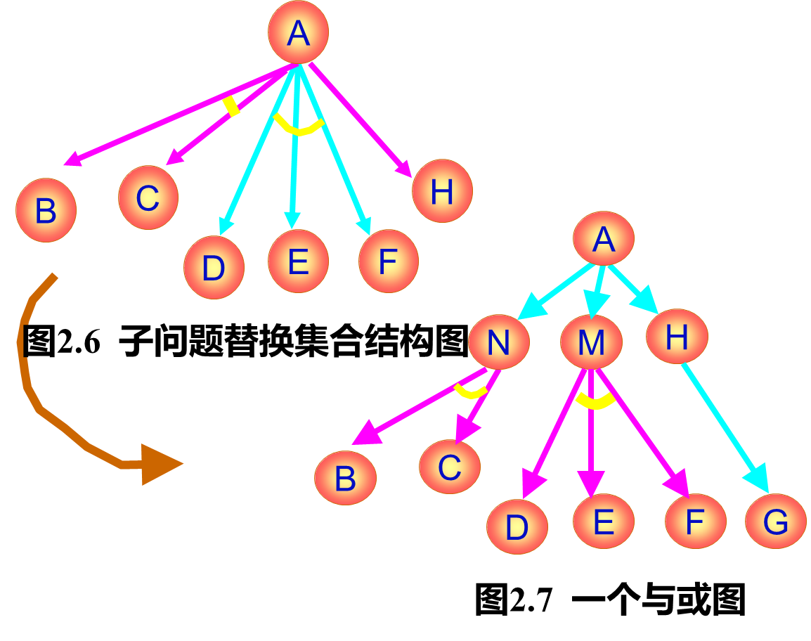

* 用一个似图结构来表示把问题归约为后继问题的替换集合
* 由与节点及或节点组成的结构图。
* 各个**与节点**用跨接指向他们后继节点的弧线的小段圆弧加以标记

##### 与或图构成规则

* 与或图中的每个节点代表一个要解决的单一问题或问题集合。

  起始节点对应于原始问题。终叶节点对应于本原问题的节点。

* 对于把算符应用于问题A的**每种可能情况**，都把问题变换为一个子问题集合；有向弧线自A指向后继节点，表示所求得的子问题集合，这些子问题节点叫做**或**节点。

* 一般对于代表**两个或两个以上子问题集合**的每个节点，有向弧线从此节点指向此子问题集合中的各个节点,这些子问题节点叫做**与**节点。

#### 起始节点

对于于原始问题描述的节点

#### 终叶节点

对应于本原问题的节点

#### 或节点

只要解决某个问题就可解决其父辈问题的节点集合，如（M，N，H）。

#### 与节点

只有解决所有子问题，才能解决其父辈问题的节点集合，如（B，C）和（D，E，F）。各个节点之间用一段小圆弧连接标记。

#### 可解节点

* 终叶节点是可解节点(因为它们与本原问题相关联)。
* 如果某个非终叶节点含有**或**后继节点，那么**只要有一个**后继节点是**可解**的时，此非终叶节点就是可解的。
* 如果某个非终叶节点含有**与**后继节点，那么只有其**全部**后继节点为**可解**时，此非终叶节点才是可解的。

> 实心节点有解，空心节点无解；标了t的节点是终叶节点，没有标的是非终叶节点。

#### 不可解节点

* **没有后裔的非终叶节点**为不可解节点。
* 如果某个非终叶节点含有**或**后继节点，那么只有当其**全部**后裔为**不可解**时，此非终叶节点才是不可解的。
* 如果某个非终叶节点含有**与**后继节点，那么只要当其后裔有**一个**为**不可解**时，此非终叶节点就是不可解的。

## 谓词逻辑表示

### 组成

1. 谓词符号
2. 变量符号
3. 函数符号
4. 常量符号

### 一阶谓词逻辑

#### 谓词符号

##### 定义

* 思维对象（个体）的属性或个体之间的关系的符号。
* 用大写字母或大写字母串表示。如：P，Q，LIKE，ON

##### 谓词形式

P(x1,x2,x3,…,xn)

#### 原子公式

谓词符号+项

#### 项

常量、变量

#### 函数符号

##### 定义

若干思维对象到某个思维对象的映射符号。用小写字母或小写字母串表示。如f,g等。

##### 函数形式

f(x1,x2,x3,…,xn)

#### 连接词

\~：否定（非）\~P

∧：合取（与）P∧Q

∨：析取（或）P∨Q

⇒：蕴涵P⇒Q(if P then Q）

 ⇔：等价P ⇔Q

#### 量词

说明个体变量的范围

$\exists$（全称量词）：“所有的”、“任意的”、“一切”、“每一个”

$\forall $（存在量词）：“有些”、“至少一个”、“存在”

#### 谓词公式

##### 原子公式/原子谓词公式

用P(x1，x2，…，xn)表示一个n元谓词公式，其中P为n元谓词，x1，x2，…，xn为客体变量或变元。通常把P(x1，x2，…，xn)叫做谓词演算的**原子公式**，或**原子谓词公式**。

##### 分子谓词公式

可以用**连词**把原子谓词公式组成**复合谓词公式**，并把它叫做分子谓词公式。

##### 合式公式

###### 递归定义

* 原子谓词公式是合式公式。
* 若A为合式公式，则～A也是一个合式公式。
* 若A和B都是合式公式，则(A∧B)，(A∨B)，(A ⇒ B)和(A ⇔B)也都是合式公式。
* 若A是合式公式，x为A中的自由变元，则(∀ x)A和(ョ x)A都是合式公式。
* 只有按上述规则求得的那些公式，才是合式公式。

###### 真值表

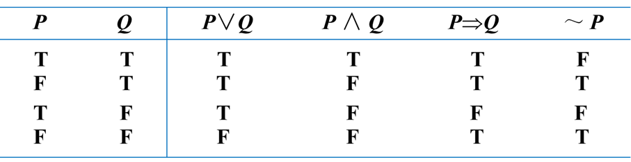

###### 性质

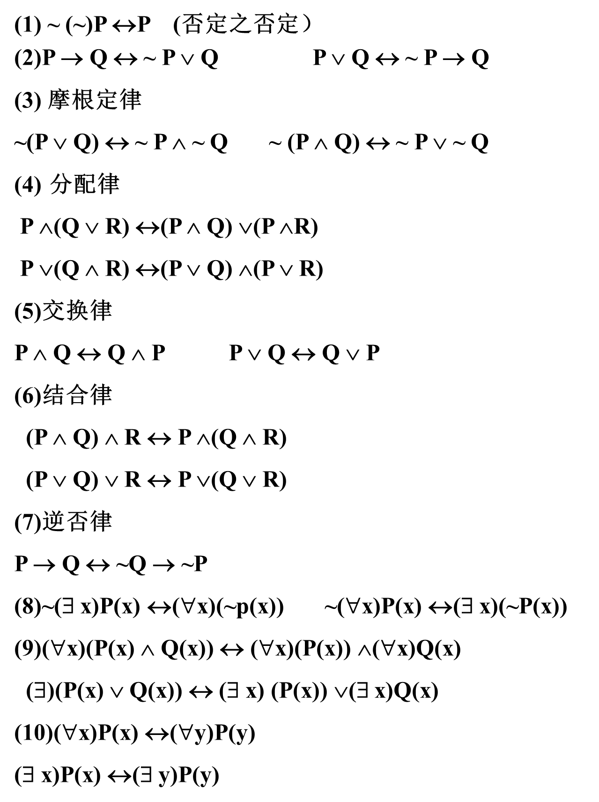

###### 等价

如果两个合式公式，无论如何解释，其真值表都是相同的，那么我们就称此两合式公式是等价的。

##### 永真式

所有可能的解释下，P均为真（T）

##### 永假式（不可满足的）

所有可能的解释下，P均为假（F）

##### 可满足的

仅在某一特定的解释下，P为真。

### 置换与合一

#### 假元推理

由合式公式 W~1~ 和 W~1~ $\Rightarrow$ W~2~ 产生合式公式 W~2~ 

#### 全称化推理

#### 综合推理

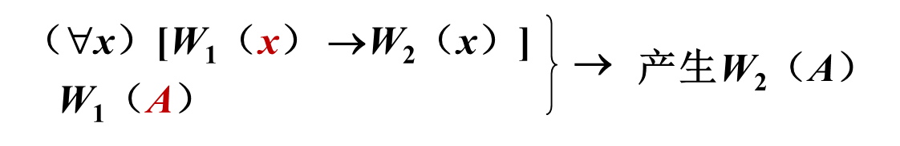

#### 置换

##### 定义

在表达式中用置换项置换变量。如果用*E*表示表达式，*s*为一置换，则置换后的表达式记为*Es*。

##### 举例

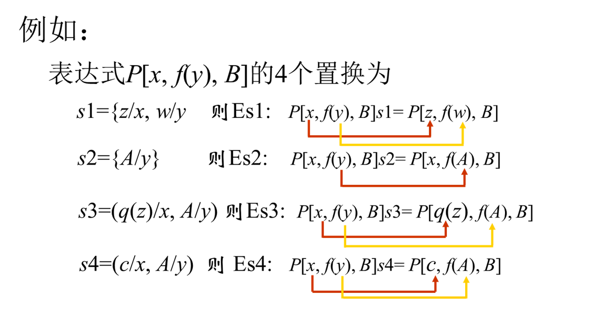

##### 性质

* 可结合律
  * （Ls1）s2=L（s1s2）
  * （s1s2）s3=s1（s2s3）
* 不可交换律：s1s2 ≠ s2s1

#### 合一

##### 合一定义

* 寻找项对变量的置换，以使两表达式一致。

> 如果一个置换s作用于表达式集{E i}的每个元素，则我们用{E i} s来表示置换例的集。

##### 可合一

称表达式集{E i}是可合一的，如果存在一个置换s使得：

$E 1 s = E 2 s = E 3 s =…$

s称为{E i}的合一者。

##### 举例

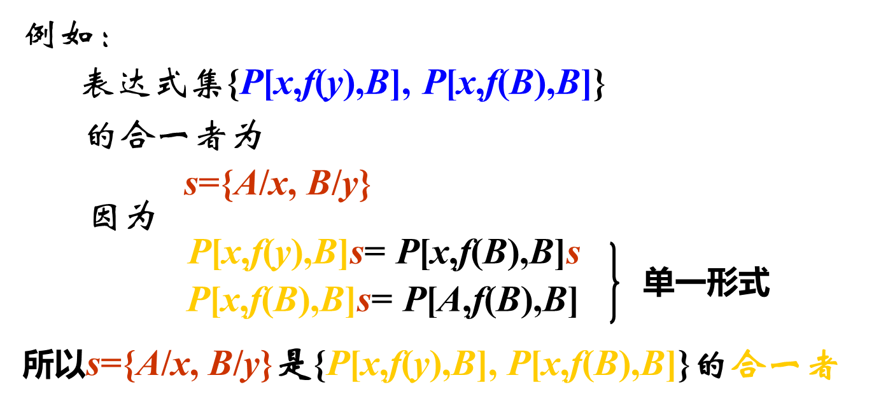

##### mgu

最通用的合一者：如果对表达式集{E~i~}的任一合一者s，都存在某一s’，使得{E~i~}s ＝ {E~i~}gs’，则称g为{E~i~}的最通用合一者，记为mgu 。

> g={B/y}是上例中{P[x,f(y),B], P[x,f(B),B]}最简单的合一者

## 语义网络表示

### 语义网络

是知识的结构化图解表示，由结点和边（也称有向弧）组成的一种有向图。（对知识的有向图表示，用有向图表示实体或概念及其语义关系）

### 结点

问题领域中的**实体**、**概念**、**情况**等。结点一般划分为实例结点和类结点。

### 弧线/链线

结点间的关系。（刻画结点之间的语义联系） 

### 组成

1. 词法部分
2. 结构部分
3. 过程部分
4. 语义部分

* 语义网络是由一些有向图表示的三元组（结点1，弧，结点2）连接而成。

* 三元组（A，R，B）的图表示：

  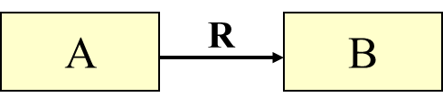

### 关系

1. 示例关系

   1. 标识：ISA

   2. 定义：表示类与其实例（个体）之间的联系。

   3. 举例：”小华是一个大学生“

      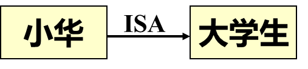

2. 分类关系（从属、泛化）

   1. 标识：AKO

   2. 定义

      1. 事物间的类属关系；
      2. 类结点与更抽象的类结点之间的联系。

      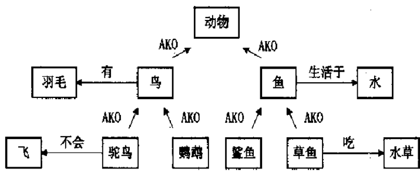

3. 聚集关系（组装）

   1. 标识：part-of

   2. 定义

      1. 表示一个个体与其组成成分之间的联系。
      2. 基于概念的分解性，将高层概念分解为若干低层概念的集合。

   3. 特点：各层结点的属性可能很不相同。

      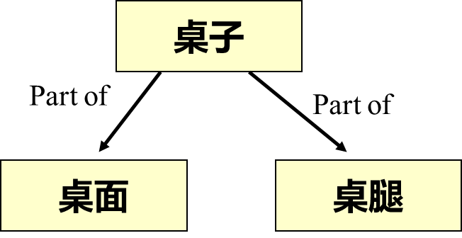

4. 属性关系

   1. 定义

      1. 表示个体、属性及其取值之间的联系。
      2. 有向弧表示属性，弧指向的结点表示属性的值。

   2. 举例

      如右图的语义网络：表示sumon是一个人，男性，40岁，职业是教师。

      

5. 集合与成员关系

   1. 定义

      1. 表示成员（元素）与集合之间的联系。
      2. “是成员”一般标识为“a-member-of”。

   2. 举例

      “张三是计算机学会会员”可表示为下图

      

6. 逻辑关系

   如果一个概念可由另一个概念推出，两个概念之间存在因果关系，则称它们之间是逻辑关系。

   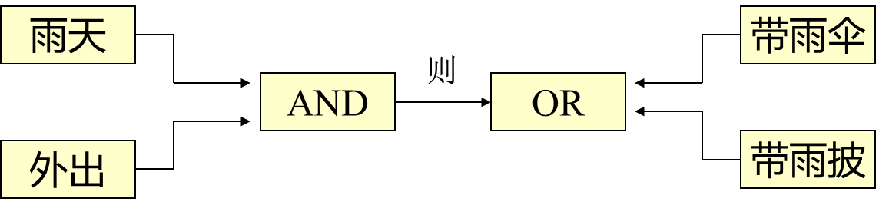

7. 方位关系

   1. 定义

      指出事物发生的时间、位置，或者指出它的组成、形状等等。

   2. 举例

      张宏是石油学院的一名助教；石油学院位于西安市电子二路； 张宏今年25岁。可用下图所示的语义网络表示。

      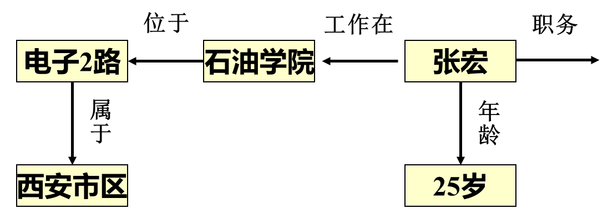

8. 所属关系

   1. 定义

      所属关系表示“具有”的意思。

   2. 举例

      “狗有尾巴”可表示为

      

### 二元语义网络

#### 选择语义基元

* 原因：通常需要把有关的一组物体或概念的知识用一个语义网络表示出来，否则会造成网络过多，使问题复杂化。
* 方法：试图用一组基元来表示知识，以便简化表示，并可用简单的知识来表示更复杂的知识，称为选择语义基元。

#### 概念节点与实例节点

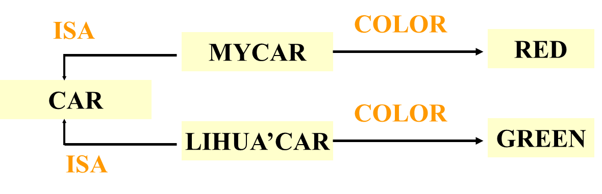

### 多元语义网络

#### 表式

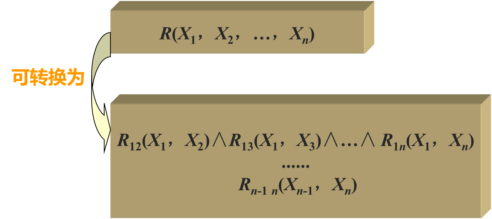

1. 语义网络可以毫无困难地表示二元关系
2. 语义网络从本质上只能表达二元关系
3. 采用二元关系的合取来表示多元关系，并且需要引入附加节点

例如：要表达北京大学(BEIJING University，简称BU)和清华大学(TSINGHUA University，简称TU)两校篮球队在北大进行的一场比赛的比分是85比89。

1. 谓词逻辑表示

   SCORE(BU，TU，(85:89))

2. 语义网络表示

   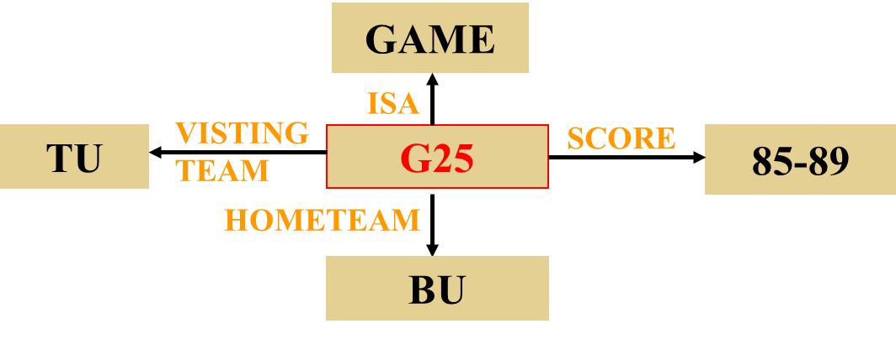

#### 推理过程

##### 继承

把对事物的描述从概念节点或类节点传递到实例节点。

>* 槽（弧）：结点的槽是从它射出的命名线。
>* 槽值：弧指向的结点。是连线的尾结点。

###### 值继承

1. 定义：实例结点肯定性继承所属类、父类的所有属性值。

2. 链：ISA、AKO

3. 举例：积木语义网络描述 

   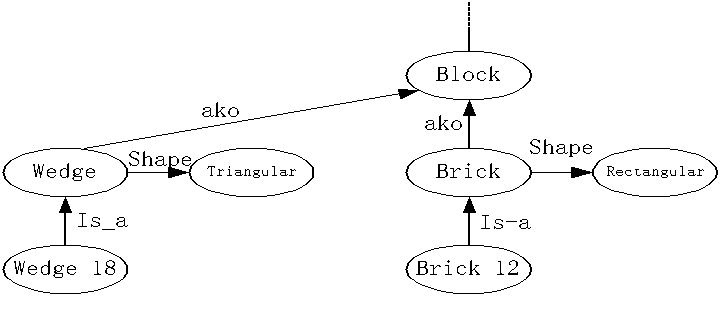

   * 实例对象Wedge18继承Wedge的Shape（外形槽）的槽值：三角形。
   * 实例对象Brick12继承Brick的Shape（外形槽）的槽值：矩形

###### ”如果需要”继承

1. 定义：当不知道槽值时，可以利用已知信息来计算

2. 举例：根据体积和物质的密度来计算积木的质量

   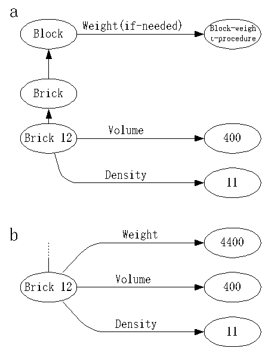

###### ”缺省”继承

1. 定义

   1. 缺省值一般为较常出现的值，或是为真的概率较高的值。当没有足够的信息确定一个值时，一般取缺省值。
   2. “结点－槽－值”：允许一个槽有多种类型的值，每一种类型对应槽的一个值类型面。因此，称缺省值类型为槽的DEFAULT面，而普通的值类型称为槽的VALUE面。

2. 举例

   下图的语义网中，积木的颜色可能是蓝色的，但长方体积木的子类中，可能的颜色是红色。在BLOCK和BRICK结点的COLOR槽的面是DEFAULT面，图中用括号表明之。

   

##### 匹配

###### 定义

当涉及由**几个部分组成的事物**时，必须考虑值的传递问题

###### 举例

1. 由于 TOY-HOUSE77 是 TOY-HOUSE 的一个实例 , 所以它必须有两个部件 , 一个是砖块 , 另一个是楔块 (wedge) 。另外 , 作为玩具房的一个部件的砖块必须 支撑楔块。在图中 , 玩具房 -77 部件以及它们之间的链 , 都用虚线画的节点和箭头来表示。因为这些知识是**通过继承而间接知道**的 , 并不是通过实际的节点和链直接知道的。因此，虚线所表示的节点以及箭头所表示的链是虚节点和虚链。

   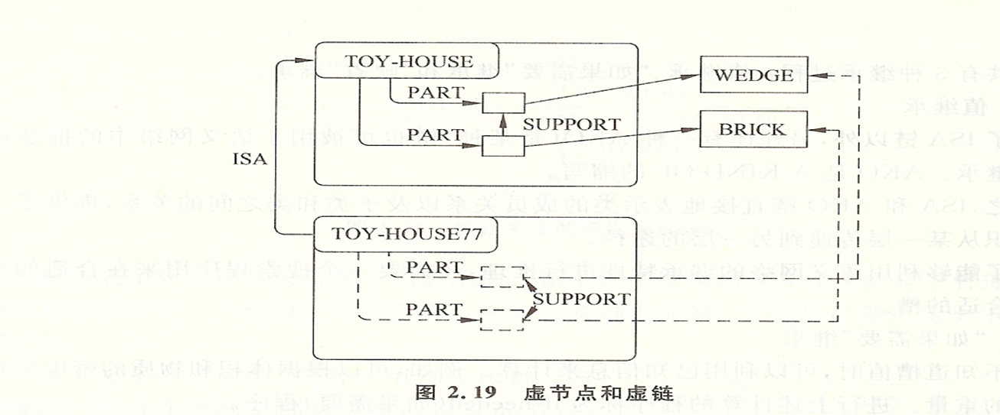

2. 下图中的结构 35(STRUCTURE35)。已知这个结构有两个部件，一 个砖块BRICK12和一个楔块WEDGE18。一旦在STRUCTURE35和TOY-HOUSE之间放上ISA链，就知道BRICK12必须支撑WEDGE18。在上图中用虚线箭头表示BRICK12和WEDGE18 之间的SUPPORT虚链。因为很容易做部件匹配，所以虚线箭头的位置和方向很容易被确定。WEDGE18肯定与作为TOY-HOUSE的一个部件的楔块相匹配，而 BRICK12 肯定与砖块相匹配。

   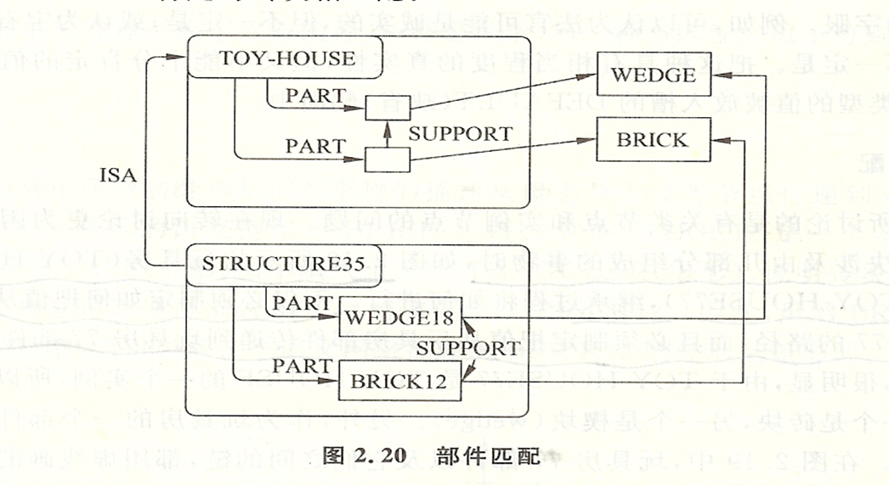

3. 知识库中有赵云所在学校的语义网络片断，赵云是一个学生，他在东方大学上学，他入校的时间是2020年，将以上知识构造一个语义网络片断（目标网络），并匹配推理出赵云主修的课程是什么？

   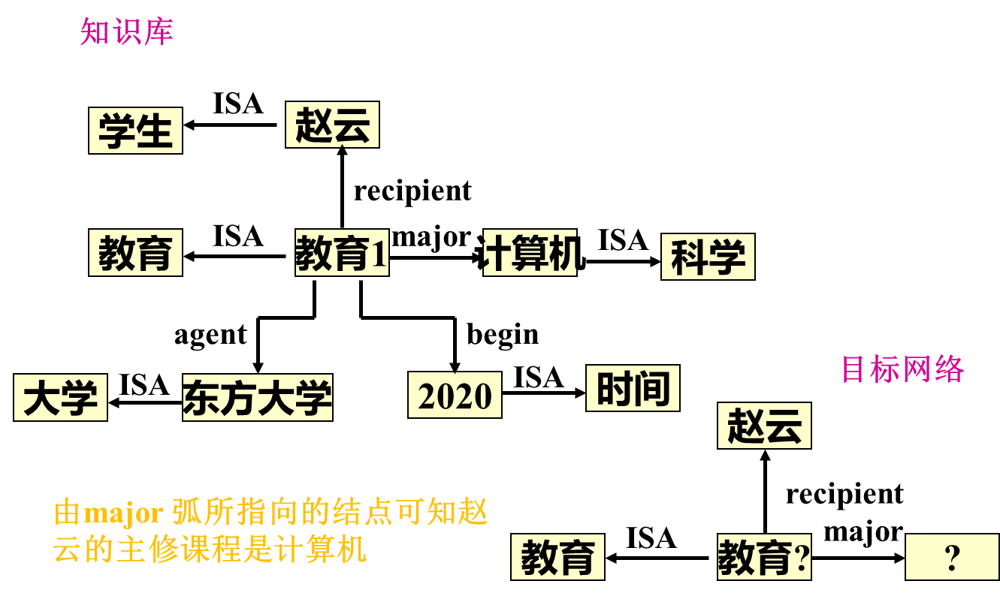

### 例题★

> 三选一

#### 小燕从春天到秋天占有一个巢

#### John给Mary一个礼物

1. 将三元关系Gives(John, Mary, Gift)转变为多个2元关系的合取

   1. 整个描述表示为一个给出事件G1，使其作为事件类Giving-Event的一个例子
   2. G1中的John是给出者（Giver）
   3. Mary是接受者（Receiver）
   4. Gift则是给出的东西（Thing）

2. 转换为二元关系：Isa(G1,Giving-Event)∧Giver(G1,John)∧Receiver(G1,Mary)∧Thing(G1,Gift)

3. 画出多元语义网络

   

#### 内尔是一头大象✦

Use semantic networks（语义网络） to represent the followings:

1. Nellie is an elephant,
2. he likes apples. 
3. Elephants are a kind of mammals,
4. they live in Africa, 
5. and they are big animals. 
6. Mammals and reptiles are both animals, 
7. all animals have head.

## 框架表示、本体技术、过程表示

老师没讲

## 习题

### 2-2 传教士野人问题

[设有3个传教士和3个野人来到河边，打算乘一只船从右岸渡到左岸去。该船的负载能力为两人。在任何时候，如果野人人数超过传教士人数，那么野人就会把传教士吃掉。他们怎样才能用这条船安全地把所有人都渡过河去?](#例3 传教士野人问题★)

### 试用四元数列结构表示四圆盘梵塔问题，并画出求解该问题的与或图

用四元数列(nA, nB, nC, nD) 来表示状态，其中nA表示A盘落在第nA号柱子上，nB表示B盘落在第nB号柱子上，nC表示C盘落在第nC号柱子上，nD表示D盘落在第nD号柱子上。

初始状态为1111，目标状态为3333

### 2-7 用谓词演算公式表示下列英文句子(多用而不是省用不同谓词和项。例如不要用单一的谓词字母来表示每个句子。)

> 考试题目可能会略有修改

A computer system is intelligent if it can perform a task which,if performed by a human, requires intelligence.

#### 方法一（推荐）

1. 先定义基本的谓词

   1. INTLT(x) means x is intelligent
   2. PERFORM(x,y) means x can perform y
   3. REQUIRE(x) means x requires intelligence
   4. CMP(x) means x is a computer system
   5. HMN(x) means x is a human

2. 上面的句子可以表达为

   (∀ x){(ョt) (ョy)[HMN(y) ∧PERFORM(y,t) ∧REQUIRE(t) ∧CMP(x) ∧PERFORM(x,t)]⇒INTLT(x) }
   
   > * t：a task
   > * x：a computer system
   > * y：a human

#### 方法二

1. P(x,y):x performs y task(x完成y任务);

2. Q(y):y requires intelligence(y需要智能)

3. C(x):x is a computer system(x是一个计算机系统) 

4. I(x):x is intelligent(x是智能的)

   (∀ x)(ョy)((C(x)∧P(x,y)∧P(human,y)∧Q(y))⇒I(x))

### 2-8 把下列语句表示成语义网络描述

1. All man are mortal.
2. Every cloud has a silver lining.
3. All branch managers of DEC participate in a profit-sharing plan.

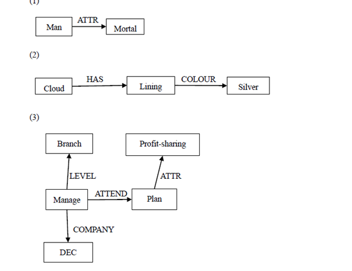

# 第3章 搜索推理技术

## 求解

初始状态→目标状态

## 图搜索策略

> 4种搜索算法（无信息：DFS、BFS；有信息（启发式）：A、A*）选1种考

### 分类

1. 按是否使用启发式信息
   1. 盲目搜索
   2. 启发式搜索
2. 按问题的表示方式
   1. 状态空间搜索：用状态空间法来求解问题所进行的搜索 
   2. 与或树搜索：用问题归约法来求解问题时所进行的搜索

### 数据结构

#### OPEN表

记录还没有扩展的点（记住下一步还可以走哪些点）

#### CLOSED表

记录已经扩展的点（记住哪些点走过了）

#### 指向父节点的指针

每个表示状态的节点结构中必须有指向父节点的指针（记住从目标返回的路径）

#### 节点的数据结构

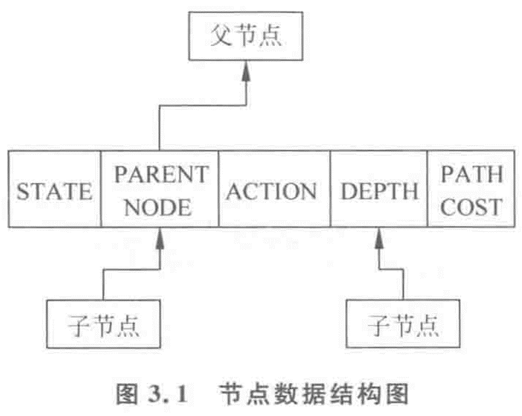

1. 状态描述
2. 指针（指明该结点在通向初始结点的父结点）
3. 从父结点转换为当前结点的操作
4. 当前节点在搜索树中的深度
5. 结点的代价估计值（从该结点到目标结点的距离)

### 图搜索(GRAPHSEARCH)的一般过程

#### [基本步骤](#3-1什么是[图搜索过程]?其中，重排OPEN表意味着什么，重排的原则是什么?)

1. 初始化；
2. 判断OPEN表是否为空；
3. 选择节点n；
4. 判断n是否目标节点；
5. 扩展节点n；
6. 修改指针方向；
7. 重排OPEN表。

#### 伪代码

1. G←S~0~,open ← S~0~;
2. closed() ←( );
3. loop: if open=( ) then return FAIL
4. n←fisrt(open);
5. remove(n,open);
6. add(n,closed)
7. if goal(n) then EXIT(success)
8. M←expand(n),G←{M,G}
9. 对于M中所有结点m:
       if m $\notin$ G then 建立指针m→n,open←add(m,open)
       if m ∈ G then 决定是否改变它的指针m→n
       if m ∈ closed  then  决定是否改变m的后继指针
10. 按某一种方式或某个试探值，对open中的结点重新排序。
11. Go loop

> 各种搜索策略的主要区别在于对Open表中节点的排列顺序不同。

#### 算法流程图

### 无信息搜索/盲目搜索

> 盲目搜索可能带来组合爆炸。

#### 定义

按预定的控制策略进行搜索，在搜索过程中获得的中间信息并不改变控制策略。 盲目性、效率不高，完备性好。

#### 宽度优先/广度优先/横向搜索

##### 特点

1. 以接近起始节点的程度逐层扩展节点
2. 没有先验知识
3. OPEN表是**队列**
4. CLOSED表是一个顺序表，表中各节点按顺序编号，正被考察的节点在表中编号最大。
5. 完备性：如果有解，则必能找到
6. 通用性：广度优先搜索策略与问题无关，具有通用性。
7. 搜索效率低

##### 算法框图

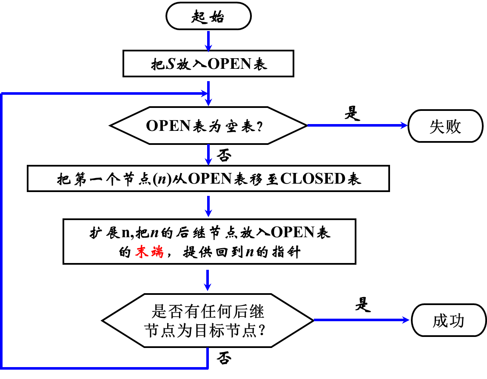

##### 例题

八数码难题（8-puzzle problem） 

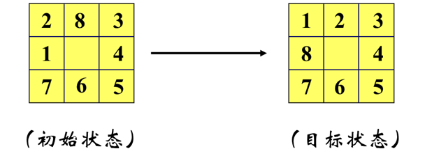

规定：将牌移入空格的顺序为：从空格左边开始顺时针旋转。不许斜向移动，也不返回先辈节点。

从下图（八数码难题的宽度优先搜索树）所示，要扩展26个节点，共生成46个节点之后才求得解（目标节点）。

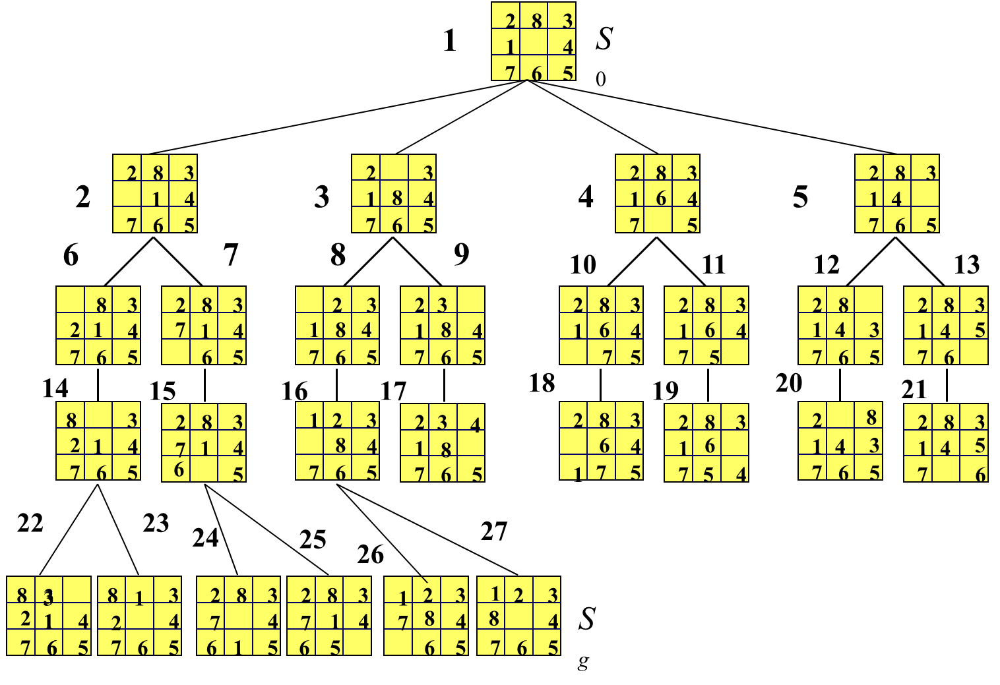

#### 深度优先/纵向搜索

##### 特点

1. 首先扩展最新产生的(即最深的)节点。
2. OPEN表是栈
3. CLOSED表是一个顺序表，表中各节点按顺序编号，正被考察的节点在表中编号最大。
4. 一般不能保证找到最优解。
5. 当深度限制不合理时，可能找不到解，可以将算法改为可变**深度限制**，即有界深度优先搜索。
6. 最坏情况时，搜索空间等同于穷举。

##### 深度界限

防止搜索过程沿着无益的路径扩展下去，往往给出一个节点扩展的最大深度

##### 算法框图

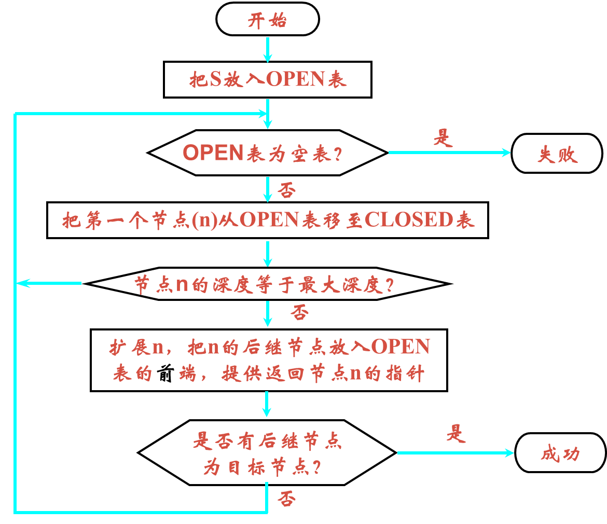

##### 例题✦

八数码难题（8-puzzle problem） 

规定：将牌移入空格的顺序为：从空格左边开始顺时针旋转。不许斜向移动，也不返回先辈节点。

###### 深度优先搜索

###### 有界深度优先搜索

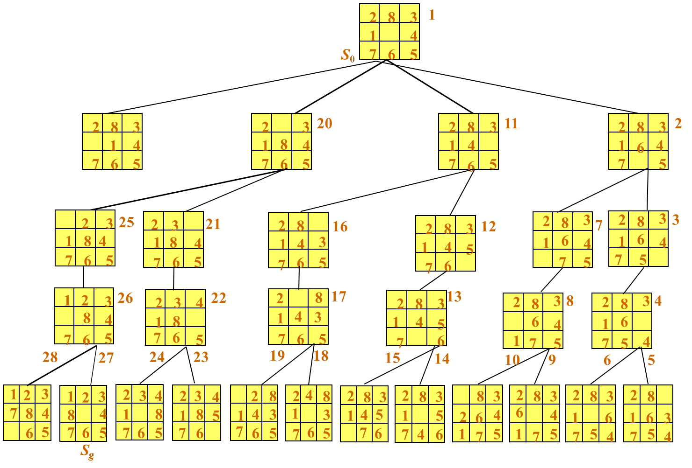

#### 等代价搜索

##### 定义

* 宽度优先搜索的一种推广，不是沿着等长度路径断层进行扩展，而是沿着等代价路径断层进行扩展。
* 搜索树中每条连接弧线上的有关代价，表示时间、距离等花费。

##### 算法

* 用g(i)表示从初始节点S0到节点i的代价，用c(i, j)表示从父节点i到其子节点j的代价。对节点j的代价有：g(j)=g(i)+c(i, j)。

* 根据g(i)递增顺序扩展节点，（对Open表中的全部结点按g(i)排序)

  > 代价树搜索的目的是为了找到最佳解，即找到一条代价最小的解路径。

##### 特点

1. 需要计算代价
2. 区分代价与长度

##### 算法框图

##### 举例

数字表示两个城市之间的交通费用，即代价。用代价树的宽度优先搜索，求从S市出发到G市，费用最小的交通路线

### 启发式搜索

#### 定义

在搜索中加入了与问题有关的启发性信息，用于指导搜索朝着**最有希望的方向**前进，**加速**问题的求解过程并找到最优解。**完备性差**。

#### 策略

* 一个节点的“希望”越大，则其 f 值越小。被选择的节点是估价函数最小的节点。
* 总是选择“最有希望”的节点作为下一被扩展节点

#### 估价函数

f(x)

#### 贪婪算法(Greedy Search)

f(x)=h(x)

#### 等代价搜索UCS

f(x)=g(x)

#### 有序搜索/最佳优先搜索

##### 策略

选择OPEN表上具有最小 f 值的节点作为下一个要扩展的节点。

##### 算法框图

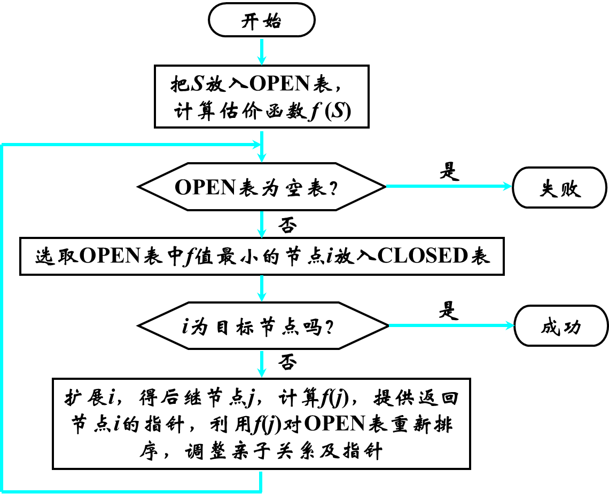

#### A算法

f(x)=g(x)+h(x)

#### A\*算法

> A\*算法只要有解，就一定是最佳解

##### 估价函数

f(x)=g(x)+h(x)

* f(x)：表示节点x的估价函数值
* g(x)：代价函数
  * 从起始状态到当前状态*x*的代价
  * g(x)>0
* h(x)：启发函数：从当前状态*x*到目标状态的估计代价
  * h(x)≤h\*(x)：不大于x到目标的实际代价

##### 算法框图

##### 八数码难题✦

###### h(x)=错放棋子数

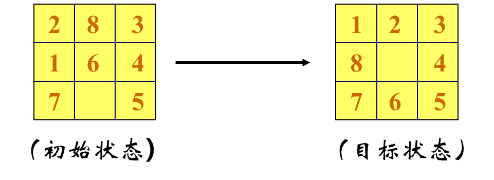

1. 估价函数的定义

   f (x) = g (x) + h (x)

   * g (x)：从初始状态到x需要进行的移动操作的次数
   * h (x)：x状态下错放的棋子数
     * 需满足限制条件
     * 空位不算错放

2. 求解过程

   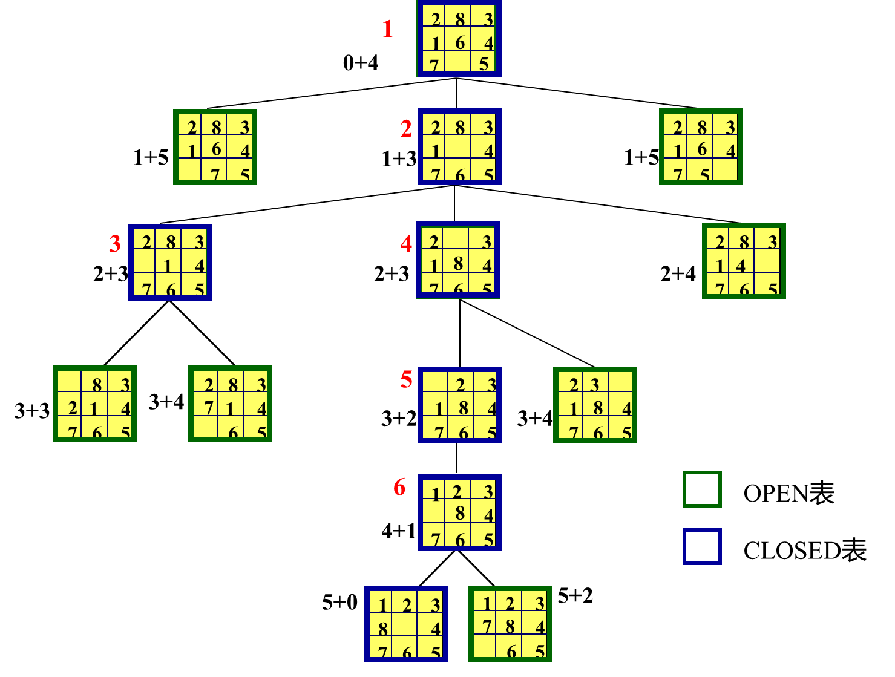

###### h(x)=曼哈顿距离✦

1. 估价函数的定义

   f (x) = g (x) + h (x)

   * g (x)：从初始状态到x需要进行的移动操作的次数

   * h (x)：每一数码与其目标位置的曼哈顿距离

     曼哈顿距离：两点之间水平距离和垂直距离之和

2. 求解过程

   

## 消解原理/归结原理

### 文字

一个原子公式及其否定。

### 子句

由文字的析取组成的合式公式。

### 消解/归结

对谓词演算公式进行分解和化简，消去一些符号，以求得导出子句。

### 消解的过程

消解规则应用于母体子句对，以便产生导出

### 子句集的求取★

> 要背熟，做题时要按步骤求解，至少要记得哪一步要干什么

将下列谓词演算公式化为一个子句集 

(∀x)｛P(x) ⇒ {(∀y)［P(y) ⇒ P(f(x,y))］∧ ～(∀y)[Q(x,y) ⇒ P(y)］｝｝

1. 消去蕴涵符号

    应用∨和～符号，以～A∨B替换A ⇒ B。

   

2. 减少否定符号的辖域

   每个否定符号～最多只用到一个谓词符号

   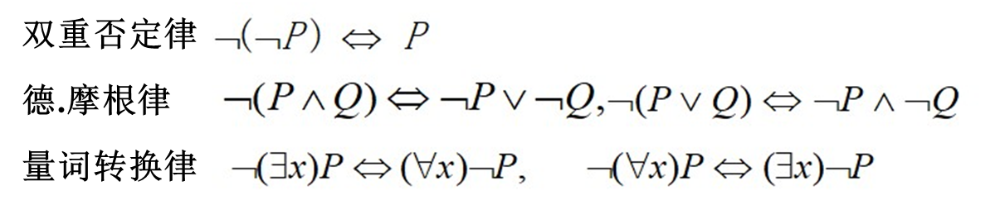

   

3. 对变量标准化

   对哑元（虚构变量）改名，以保证每个量词有其自己*唯一的哑元*。

   (∀x)(P(x)(ョx)Q(x)) $\Rightarrow$ (∀x)P(x)(ョy)Q(y)

   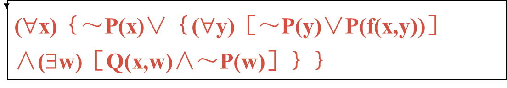

4. 消去存在量词ョ

   1. 对于**全称量词辖域内的存在量词**，以Skolem函数代替存在量词内的约束变量
   2. 对于自由存在量词，以一个新常量替代

   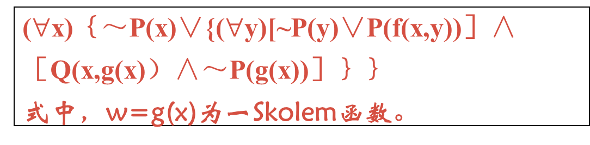

5. 化为前束形

   把所有**全称量词**移到公式的**左边**，并使每个量词的辖域包括这个量词后面公式的整个部分。

   前束形={前缀}(全称量词串) {母式}(无量词公式)

   

6. 把母式化为合取范式

   任何母式都可写成由一些谓词公式和(或)谓词公式的否定的析取的有限集组成的合取。(分配律)

   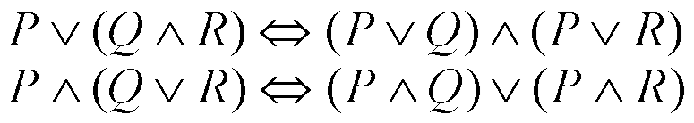

   

7. 消去全称量词

   所有余下的量词均被全称量词量化了。消去前缀，即消去明显出现的全称量词。

   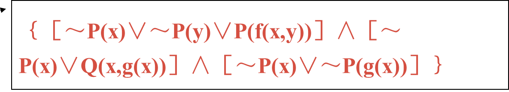

8. 消去连词符号∧

   用{A,B}代替(A∧B)，消去符号∧。最后得到一个有限集，其中每个公式是文字的析取。

   

9. 更换变量名称

   可以更换变量符号的名称，使一个变量符号不出现在一个以上的子句中。

   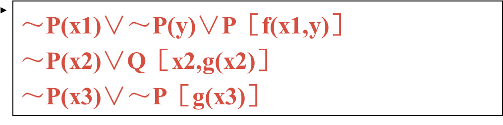

### 消解推理规则

#### 鲁宾逊消解原理

* 检查子句集 S 中是否包含空子句，若包含，则 S 不可满足。
* 若不包含，在 S 中选择合适的子句进行消解，一旦消解出空子句，就说明 S 是不可满足的。

#### 消解式的求法

取两个子句的析取，然后消去互补对，得到消解式

#### 消减式例子★

> [消解反演求空子句](#消解反演)会要用到

1. 假言推理 Modus ponens

   

2. 合并 Combination

   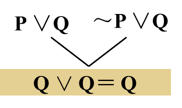

   

3. 重言式 Tautologies

   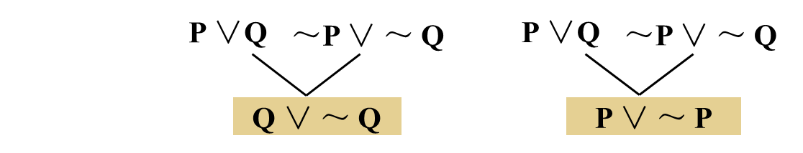

4. 空子句 NIL Clause：不包含任何文字的子句。

   消解过程中出现空子句，说明S中必有矛盾。

   

5. 链式（三段论） Chain

   > 书上P100的三段论也许有误

   

#### 消减推理过程

从子句集S出发，对S的子句使用消解推理规则，将所得的消解式放入S中，再进行消解推理，直到得到空子句（NIL）,则说明S是不可满足的，即公式G是不可满足的。

#### 含有变量的消解式

要把消解推理规则推广到含有变量的子句，必须找到一个作用于父辈子句的**置换**，使父辈子句含有互补文字。

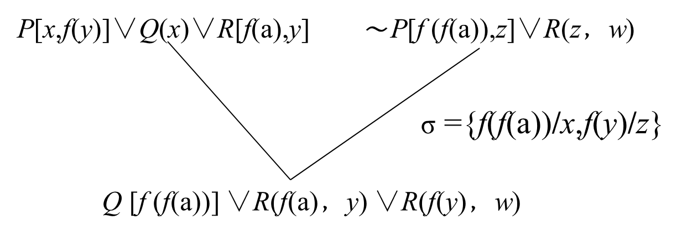

#### 消解反演求解过程

##### 消解反演

###### 步骤

给出公式集{S}和目标公式B

1. 否定B，得～B；
2. 把～B添加到S中去；
3. 把新产生的集合｛ ～B，S｝化成子句集；
4. 应用消解原理，力图推导出一个表示矛盾的空子句

###### 例题

> 其它的例题也可能考，但储蓄问题考的可能性最大

1. 储蓄问题★（A卷）

   > 本题可能会有部分改动，会放在一个题目的中间，要认真审题，步骤环环相扣

   1. 前提：每个储蓄钱的人都获得利息。

   2. 结论：如果没有利息，那么就没有人去储蓄钱

   3. 证明

      1. 规定原子公式  

         1. S(x,y)表示“x储蓄y”
         2. M(x)表示“x是钱”
         3. I(x)表示“x是利息”
         4. E(x,y)表示“x获得y”

      2. 用谓词公式表示前提和结论

         > 我修改了一下，书上P101答案好像有点问题

         1. 前提：(∀x)[ [(ョy)(S(x,y) ∧ M(y))] ⇒ [(ョy)(I(y) ∧ E(x,y))] ]
         2. 结论：～[(ョx)I(x)] ⇒ (∀x)(∀y)(M(y) ⇒ ～S(x,y))

      3. 将前提和结论的否定[化为子句集](#子句集的求取（9个步骤）)（考试中化简过程可以省略）

         1. 前提：(∀x)[ [(ョy)(S(x,y) ∧ M(y))] ⇒ [(ョy)(I(y) ∧ E(x,y))] ]

            1. 消去蕴含符号

               (∀x)[ [～[(ョy)(S(x,y) ∧ M(y))] ] ∨ [(ョy)(I(y) ∧ E(x,y))] ]

            2. 减少否定符号的辖域

               1. (∀x)[ [(～ョy)(～S(x,y) ∨ ～M(y))] ∨ [(ョy)(I(y) ∧ E(x,y))] ]
               2. (∀x)[ [(∀y)(～S(x,y) ∨ ～M(y))] ∨ [(ョy)(I(y) ∧ E(x,y))] ]

            3. 对变量标准化

               无需此步

            4. 消去存在量词

               1. 定义Skolem函数：y=f(x)
               2. (∀x)[ [(∀y)(～S(x,y) ∨ ～M(y))] ∨ [(I(f(x)) ∧ E(x,f(x)))] ]

            5. 化为前束形

               (∀x)(∀y)[ (～S(x,y) ∨ ～M(y)) ∨ [(I(f(x)) ∧ E(x,f(x)))] ]

            6. 把母式化为合取范式

               (∀x)(∀y)[ [～S(x,y) ∨ ～M(y) ∨ I(f(x))] ∧ [～S(x,y) ∨ ～M(y) ∨ E(x,f(x))] ]

            7. 消去全称量词

               [～S(x,y) ∨ ～M(y) ∨ I(f(x))] ∧ [～S(x,y) ∨ ～M(y) ∨ E(x,f(x))]

            8. 消去连词符号∧

               > 化简完的所有子句在答案中必须写出

               * 子句①：～S(x,y) ∨ ～M(y) ∨ I(f(x))
               * 子句②：～S(x,y) ∨ ～M(y) ∨ E(x,f(x))

            9. 更换变量名称

               书上没有此步，不过感觉更换了更好

         2. 结论的否定：～[～(ョx)I(x) ⇒ (∀x)(∀y)(M(y) ⇒ ～S(x,y))]

            1. 消去蕴含符号

               1. ～[～[(ョx)I(x)] ⇒ (∀x)(∀y)(～M(y) ∨ ～S(x,y))]
               2. ～[(ョx)I(x) ∨ (∀x)(∀y)(～M(y) ∨ ～S(x,y))]

            2. 减少否定符号的辖域

               1. [～(ョx)I(x) ∧ [～[(∀x)(∀y)(～M(y) ∨ ～S(x,y))] ] ]
               2. (∀x)(～I(x)) ∧ [(ョx)(ョy)(M(y) ∧ S(x,y))]

            3. 对变量标准化

               无需此步

            4. 消去存在量词

               用常量a替代x，b替代y

               (∀x)(～I(x)) ∧ (M(b) ∧ S(a,b))

            5. 化为前束形

               (∀x)(～I(x) ∧ (M(b) ∧ S(a,b)) )

            6. 把母式化为合取范式

               (∀x)(～I(x) ∧ M(b) ∧ S(a,b) )

            7. 消去全称量词

               ～I(x) ∧ M(b) ∧ S(a,b)

            8. 消去连词符号∧

               > 化简完的所有子句在答案中必须写出

               * 子句③：～I(x)
               * 子句④：S(a,b)
               * 子句⑤：M(b)

            9. 更换变量名称

               * 子句③：～I(z)
               * 子句④：S(a,b)
               * 子句⑤：M(b)

      4. 消解反演求空子句（NIL）

         储蓄问题反演树

         

2. 某公司招聘工作人员，A，B，C三人应试★（B卷考）

   1. 前提

      1. 三人中至少录取一人
      2. 如果录取A而不录取B，则一定录取C
      3. 如果录取B，则一定录取C

   2. 结论：公司一定录取C

   3. 证明

      1. 规定原子公式  

         P(x)表示录取x

      2. 用谓词公式表示前提和结论

         1. 前提
            1. P(A) ∨ P(B) ∨ P(C)
            2. (P(A) ∧ ~P(B)) ⇒ P(C)
            3. P(B) → P(C)
         2. 结论：P(C)

      3. 将前提和结论的否定[化为子句集](#子句集的求取（9个步骤）)（考试中化简过程可以省略）

         1. 前提

            1. 子句①：P(A) ∨ P(B) ∨ P(C)
            2. 子句②：~P(A) ∨ P(B) ∨ P(C) 
            3. 子句③：~P(B) ∨ P(C)

         2. 结论的否定

            子句④：~P(C)

         3. 证明 

            

3. 设事实的公式集合

   1. 前提

      1. P
      2. (P∧Q)⇒ R
      3. (S∨T) ⇒ Q
      4. T

   2. 结论：R

   3. 证明

      1. 子句集

         1. P
         2. ～P ∨～Q ∨ R
         3. ～S ∨ Q
         4. ～T ∨ Q
         5. T
         6. ～R

      2. 消解演绎树/消解反演树

         > 用一棵树直观地表达消解推理过程
         
         

4. Happy student

   1. 前提

      Everyone who pass the computer test and win the prize is happy. Everyone who wish study or is lucky can pass all tests. Zhang doesn’t study, but he is lucky. Every lucky person can win the prize. 

   2. 结论

      Zhang is happy

   3. 证明

      1. 规定原子公式

         1. Pass(x,y)：x pass y test
         2. Win(x,y)：x win y
         3. Happy(x)：x is happy
         4. Study(x)：x study
         5. Lucky(x)：x is lucky

      2. 用谓词公式表示前提和结论

         1. 前提

            

         2. 结论的否定：~Happy（zhang）
      
      3. 将前提和结论的否定[化为子句集](#子句集的求取（9个步骤）)（考试中化简过程可以省略）
      
         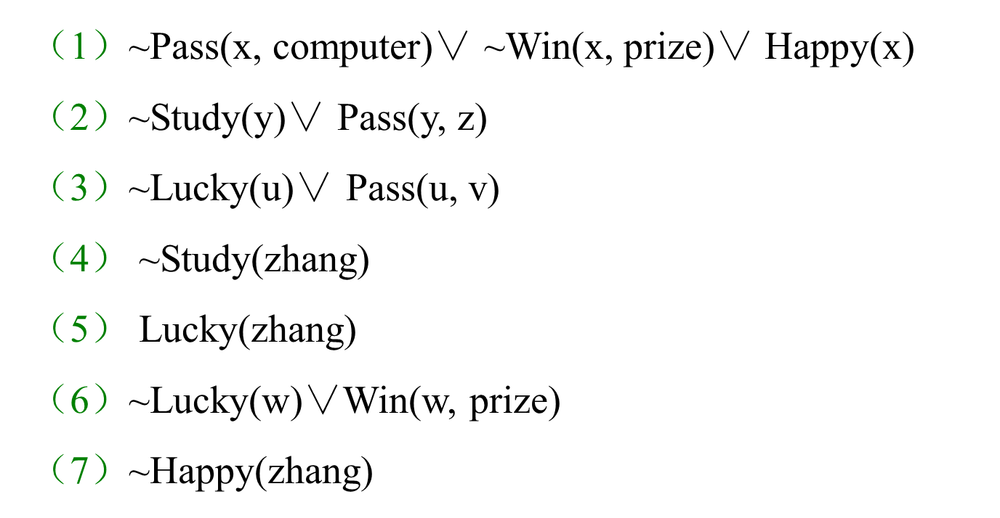
      
      4. 消解演绎树/消解反演树
      
         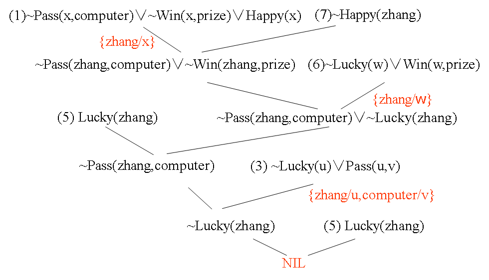

##### 反演求解

###### 过程

1. 把由目标公式的否定产生的每个子句添加到目标公式否定之否定的子句中去。
2. 按照反演树，执行和以前相同的消解，直至在根部得到某个子句止。
3. 用根部的子句作为一个**回答语句**

###### 实质

根部为 NIL 变换为根部为回答语句

###### 例题

1. 消减反演

   1. 前提

      1. 无论JOHN到哪里，FIDO也就去那里

      2. JOHN现在学校里。

   2. 结论：FIDO在什么地方是可以确定的。

   3. 证明

      1. 原子公式定义与谓词表示 

         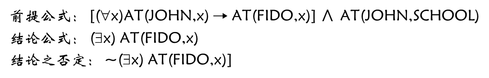

      2. 子句集求解

      

      3. 消解反演推理

      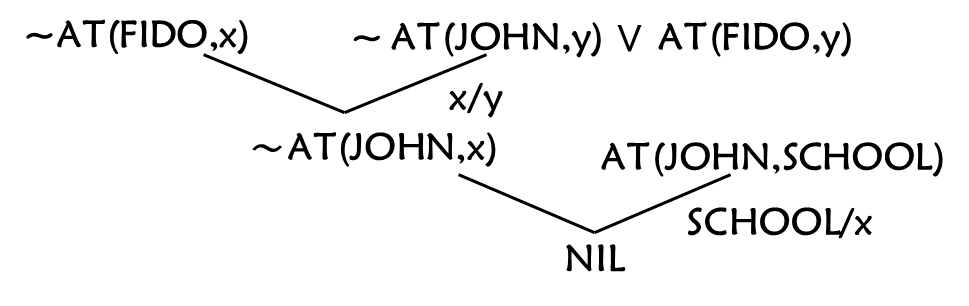

      4. 结论成立！

2. 反演求解

   无论JOHN到哪里，FIDO也就去那里; JOHN现在学校里。问：FIDO在什么地方？

   

### 规则演绎系统...

后面的应该是没讲，估计不考

## 习题

### 3-1什么是[图搜索过程](#图搜索(GRAPHSEARCH)的一般过程)?其中，重排OPEN表意味着什么，重排的原则是什么?

1. 图搜索的一般过程如下：（描述图搜索（GRAPHSERCH）的一般过程）（用文字或流程图）

   1. 建立一个搜索图G(初始只含有起始节点S)，把S放到未扩展节点表中（OPEN表）中。

   2. 建立一个已扩展节点表（CLOSED表），其初始为空表。

   3. **LOOP**：若OPEN表是空表，则**失败**退出。

   4. 选择OPEN表上的第一个节点 n，把它从OPEN表移出并放进CLOSED表中。

   5. 若n为一目标节点，则有解并**成功**退出。

      > 此解是追踪图G中沿着指针从n到S这条路径而得到的(指针将在第7步中设置)

   6. 扩展节点n，生成后继节点的集合M。

   7. 修改M成员的指针方向

      1. 对那些未曾在G中出现过的(既未曾在OPEN表上或CLOSED表上出现过的)M成员
         1. 设置一个通向n的指针
         2. 将它们加进OPEN表
      2. 对已经在OPEN或CLOSED表上的每个M成员，确定是否需要将其原来的父节点改为 n
      3. 对已在CLOSED表上的每个M成员，若修改了其父节点，则将该节点从 CLOSED 表中移出，重新加入 OPEN 表中。

   8. 按某一任意方式或按某个试探值，重排OPEN表。

   9. GO **LOOP**。

2. 重排OPEN表意味着，在第(6)步中，将优先扩展哪个节点，**不同的排序标准对应着不同的搜索策略**。

3. 重排的原则当视具体需求而定，不同的原则对应着不同的搜索策略

   1. 如果想尽快地找到一个解，则应当将**最有可能**达到目标节点的那些节点排在OPEN表的前面部分
   2. 如果想找到代价最小的解，则应当按**代价从小到大**的顺序重排OPEN表。

###  3-4 如何通过消减反演求取问题的答案？※

[详见反演求解的过程](#反演求解)

### 3-7 八数码难题

用A\*算法绘出八数码难题的搜索树；标记OPEN表、CLOSED表的节点；写出从初始状态到目标状态的最优解。[详见](#八数码难题✦)

### 3-12  把下列句子变换成子句形式

子句集的求取的9个步骤：
1.	消去蕴含符号
2.	减少否定符号的辖域
3.	对变量标准化
4.	消去存在量词
5.	化为前束形
6.	把母式化为合取范式
7.	消去全称量词
8.	消去连词符号∧
9.	更换变量名称

求解：

1. (∀x){P(x)⇒P(x)}
   1. 消去蕴含符号：(∀x){~P(x)∨P(x)}

   2. 2-6 无需进行操作

   3. 消去全称量词：~P(x)∨P(x)

   4. 8-9 无需进行操作

2. (∀x)(∀y)(On(x,y)⇒Above(x,y))

     1. 消去蕴含符号：(∀x)(∀y)(~On(x,y)∨Above(x,y))

     2. 2-6 无需进行操作

     3. 消去全称量词：~On(x,y)∨Above(x,y)

     4. 8-9 无需进行操作

3. (∀x)(∀y)(∀z)(Above(x,y)∧Above(y,z)⇒Above(x,z))

   > 蕴含的优先级低于∧
   
      1. 消去蕴含符号：(∀x)(∀y)(∀z)(\~(Above(x,y)∧Above(y,z))∨Above(x,z))
   
      1. 减少否定符号的辖域：(∀x)(∀y)(∀z)(\~Above(x,y)∨\~Above(y,z)∨Above(x,z))
   
      1. 3-6. 无需进行操作
   
      1. 消去全称量词：\~Above(x,y)∨\~Above(y,z)∨Above(x,z)
   
      1. 8-9 无需进行操作

4. \~((∀x)P(x)⇒((∀y)(P(y)⇒P(f(x,y)))∧(∀y)(Q(x,y)⇒P(y)))))

   > 太难了，赌它不考

   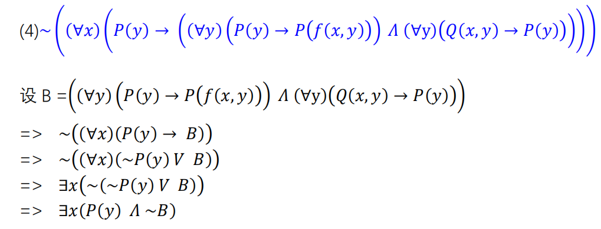

   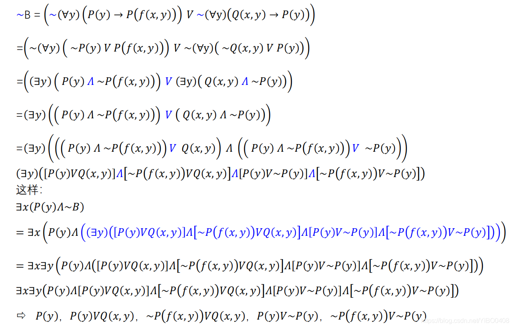

# 第4章 计算智能

## 计算智能✦

计算智能取决于制造者提供的**数值数据**，而**不依赖于知识**。计算智能是智力的**低层**认知。

## 计算智能系统

* 当一个系统只涉及数值（低层）数据，含有模式识别部分，不应用人工智能意义上的知识，而且能够呈现出：

  1. 计算适应性；

  2. 计算容错性；

  3. 接近人的速度；

  4. 误差率与人相近

* 则该系统就是**计算智能系统**。

## 计算智能(CI)与人工智能(AI)的区别和关系✦

* 计算智能是一种智力的**低层**认知，它与人工智能的区别只是认知层次从**中层**下降至**低层**而已。中层系统含有**知识**（精品），低层系统则没有。
* 当一个**计算智能**系统以非数值方式加上**知识**（精品）值，即成为**人工智能系统**。

## 相关术语

* ABC
  * A－Artificial，表示人工的（非生物的）；
  * B－Biological，表示物理的＋化学的＋（？）＝生物的；
  * C－Computational，表示数学＋计算机
* NN：神经网络
* PR：模式识别
* I：智能

| 术语 |                          |                                 |
| ---- | ------------------------ | ------------------------------- |
| BN   | 人类智能硬件：大脑       | 人的传感输入处理                |
| ANN  | 中层模型：CNN＋知识精品  | 以大脑方式的中层处理            |
| CNN  | 低层，生物激励模型       | 以大脑方式的传感数据处理        |
| BPR  | 对人的传感数据结构的搜索 | 对人的感知环境中结构的识别      |
| APR  | 中层模型：CPR＋知识精品  | 中层数值和语法处理              |
| CPR  | 对传感数据结构的搜索     | 所有CNN＋模糊、统计和确定性模型 |
| BI   | 人类智能软件：智力       | 人类的认知、记忆和作用          |
| AI   | 中层模型：CI＋知识精品   | 以大脑方式的中层认知            |
| CI   | 计算推理的低层算法       | 以大脑方式的低层认知            |

## 神经计算（ANN，人工神经网络）

### 研究进展

1. 1943年的**M－P模型**与神经元互联模型。
2. 1960年代，提出神经网络学习模型和**感知器**等。
3. 70年代至80年代，神经网络研究进一步发展，提出**BP算法**（Werbos）等。
4. 80年代后期以来，对神经网络的研究十分活跃，继续取得进展并在模式识别、图像处理、自动控制、机器人、管理、商业和军事等领域得到普遍应用。

### ANN的特性

1. 并行分布处理
2. 非线性映射
3. 通过训练进行学习
4. 适应与集成
5. 硬件实现

### 人工神经网络的结构

#### 神经元

神经元单元由多个输入x~i~，i=1,2,...,n和一个输出y组成。中间状态由输入信号的权和表示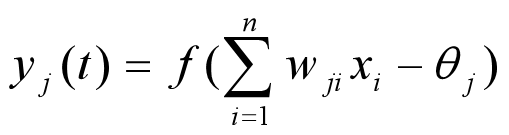

* θ~j~为神经元单元的偏置（阈值）

* w~ji~为连接权系数

* n为输入信号数目

* y~j~为神经元输出

* t为时间

* f(_)为输出变换函数。

  

#### 两类结构

##### 递归（反馈）网络

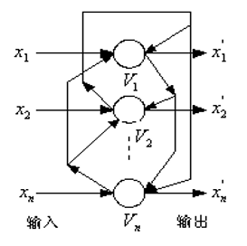

在递归网络中，多个神经元互连以组织一个互连神经网络

##### 前馈网络

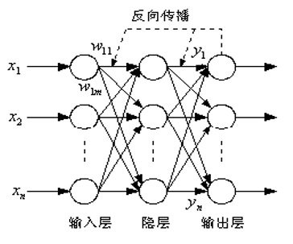

前馈网络具有递阶分层结构，由同层神经元间不存在互连的层级组成

#### 学习算法✦

##### 有师学习

Supervised learning algorithms（有师学习）：能够根据**期望**的和**实际**的网络**输出**（对应于给定输入）间的**差**来**调整**神经元间连接的强度或权。

##### 无师学习

Unsupervised learning algorithms（无师学习）：不需要知道期望输出。

##### 增强学习

Reinforcement learning algorithms（增强学习）：采用一个“**评论员**”来评价与给定输入相对应的神经网络输出的**优度**（质量因数）。强化学习算法的一个例子是遗传算法（GA）。

### 人工神经网络示例及其算法

| 模型名称         | 有师或无师 | 学习规则      | 正向或反向传播 | 应用领域       |
| ---------------- | ---------- | ------------- | -------------- | -------------- |
| AG               | 无         | Hebb律        | 反向           | 数据分类       |
| SG               | 无         | Hebb律        | 反向           | 信息处理       |
| ART-I            | 无         | 竞争律        | 反向           | 模式分类       |
| DH               | 无         | Hebb律        | 反向           | 语音处理       |
| CH               | 无         | Hebb/竞争律   | 反向           | 组合优化       |
| BAM              | 无         | Hebb/竞争律   | 反向           | 图象处理       |
| AM               | 无         | Hebb律        | 反向           | 模式存储       |
| ABAM             | 无         | Hebb律        | 反向           | 信号处理       |
| CABAM            | 无         | Hebb律        | 反向           | 组合优化       |
| FCM              | 无         | Hebb律        | 反向           | 组合优化       |
| LM               | 有         | Hebb律        | 正向           | 过程监控       |
| DR               | 有         | Hebb律        | 正向           | 过程预测，控制 |
| LAM              | 有         | Hebb律        | 正向           | 系统控制       |
| FAM              | 有         | Hebb律        | 正向           | 知识处理       |
| BSB              | 有         | 误差修正      | 正向           | 实时分类       |
| Perceptron       | 有         | 误差修正      | 正向           | 线性分类，预测 |
| Adaline/Madaline | 有         | 误差修正      | 反向           | 分类，噪声抑制 |
| BP               | 有         | 误差修正      | 反向           | 分类           |
| AVQ              | 有         | 误差修正      | 反向           | 数据自组织     |
| CPN              | 有         | Hebb律        | 反向           | 自组织映射     |
| BM               | 有         | Hebb/模拟退火 | 反向           | 组合优化       |
| CM               | 有         | Hebb/模拟退火 | 反向           | 组合优化       |
| AHC              | 有         | 误差修正      | 反向           | 控制           |
| ARP              | 有         | 随机增大      | 反向           | 模式匹配，控制 |
| SNMF             | 有         | Hebb律        | 反向           | 语音/图象处理  |

### 基于神经网络的知识表示与推理

#### 与运算

##### 神经网络实现与逻辑

##### 输入输出关系函数

##### 满足与(and)关系的权值

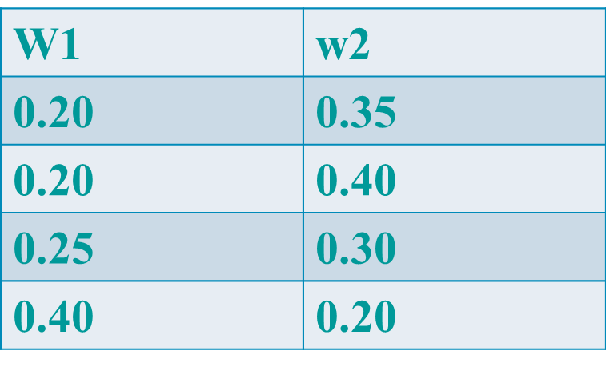

#### 或运算、非运算

没找着，懒得写了

#### 异或★

> 以下面两种结构的神经网络为例

##### 神经网络实现异或逻辑

1. 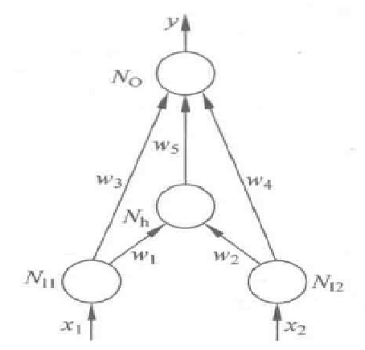
2. 

##### 函数

1. 网络1

   1. 输入输出关系函数函数

      1. y = f(x1·w3 + x2·w4 + z·w5)
      2. N~h~ \= z \=f(x1·w1+x2·w2)

   2. 阈值函数f

      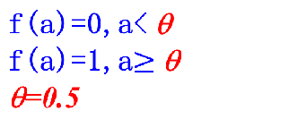

   3. 邻接矩阵

      |       | N~I1~ | N~I2~ | N~h~ | N~O~ |
      | ----- | ----- | ----- | ---- | ---- |
      | N~I1~ | 0     | 0     | 0.3  | 1    |
      | N~I2~ | 0     | 0     | 0.3  | 1    |
      | N~h~  | 0     | 0     | 0    | -2   |
      | N~O~  | 0     | 0     | 0    | 0    |

   4. 权值向量(w1,w2,w3,w4,w5)

      (0.3,0.3,1,1,-2)

   5. 阈值向量

      (0,0,0,0,0)

   6. 真值表

      | x1   | x2   | z/N~h~     | y             |
      | ---- | ---- | ---------- | ------------- |
      | 0    | 0    | 0<0.5=0    | 0<0.5=0       |
      | 0    | 1    | 0.3<0.5=0  | 0+1=1>=0.5=1  |
      | 1    | 0    | 0.3<0.5=0  | 0+1=1>=0.5=1  |
      | 1    | 1    | 0.6>=0.5=1 | 1+1-2=0<0.5=0 |

2. 网络2

   1. 输入输出关系函数函数

      1. N~h1~= f (x~1~·1.6 + x~2~·(-0.6)-1)
      2. N~h2~= f (x~1~·(-0.7) + x~2~·2.8-2.0)
      3. y=N~0~=f (N~h1~·2.102+N~h2~·3.121)

   2. 阈值函数f

      
   
   3. 邻接矩阵
   
      |       | N~I1~ | N~I2~ | N~h1~ | N~h2~ | N~O~  |
      | ----- | ----- | ----- | ----- | ----- | ----- |
      | N~I1~ | 0     | 0     | 1.6   | -0.7  | 0     |
      | N~I2~ | 0     | 0     | -0.6  | 2.8   | 0     |
      | N~h1~ | 0     | 0     | 0     | 0     | 2.102 |
      | N~h2~ | 0     | 0     | 0     | 0     | 3.121 |
      | N~O~  | 0     | 0     | 0     | 0     | 0     |
   
   4. 阈值向量
   
      (0,0,-1,-2,0)

#### 基于神经网络的知识推理

todo：知识获取、知识库、泛化能力

## 模糊计算

todo

## 进化算法与遗传算法

### 进化算法分类

1. 遗传算法(Genetic Algorithm, GA)
2. 进化策略(Evolutional Strategy, ES)
3. 进化编程(Evolutional Programming, EP)
4. 遗传编程(Genetic Programming, GP)

### 基本概念

#### 个体

* 模拟生物个体而对问题中的对象（一般就是问题的解）的一种称呼
* 一个个体也就是搜索空间中的一个点

#### 种群(population)

* 模拟生物种群而由若干个体组成的群体
* 一般是整个搜索空间的一个很小的子集
* 通过对种群实施遗传操作，使其不断更新换代而实现对整个论域空间的搜索

#### 适应度(fitness)

借鉴生物个体对环境的适应程度，而对问题中的个体对象所设计的表征其优劣的一种测度

#### 适应度函数(fitness function)

* 问题中的全体个体与其适应度之间的一个对应关系
* 一般是一个实值函数，该函数就是遗传算法中指导搜索的评价函数 

####  染色体(chromosome)

* 生物学：染色体是由若干基因组成的位串
* 遗传算法
  * 染色体是问题中个体的某种字符串形式的编码表示
  * 染色体以字符串来表示
  * 基因是字符串中的一个个字符

#### 编码与解码

##### 编码(Encoding)

将问题结构变换为位串形式编码表示的过程

##### 解码/译码(Decoding)

将位串形式编码表示变换为原问题结构的过程

##### 二进制编码解码

1. 编码长度

   编码长度取决于自变量的范围（更准确点应该是决策变量的范围）和搜索精度

   此处初始群体的每个个体用一个长度为10的二进制串来表示

2. 自变量的范围：5-（-5）= 10

3. 搜索精度：0.01

   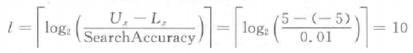

4. 实际的搜索精度：0.009775

   

5. 解码

   二进制信息转换成十进制公式

   

#### 适应度

##### 算法思想

* 个体适应度计算

  * 在被选集中每个个体具有一个选择概率
  * 选择概率取决于种群中个体的适应度及其分布
  * 个体适应度计算，即个体选择概率计算

* 个体选择方法

  按照适应度进行父代个体的选择

##### 计算算法

1. 按比例的适应度计算(proportional fitness assignment)
2. 基于排序的适应度计算(rank-based fitness assignment)

#### 遗传算子(genetic operator)

* 模拟生物界优胜劣汰的自然选择法则的一种染色体运算
* 从种群中选择适应度较高的染色体进行复制，以生成下一代种群

##### 选择(selection)

1. 轮盘赌选择(roulette wheel selection)

   1. 原理

      

      1. 做一个单位圆，然后按各个染色体的选择概率将圆面划分为相应的扇形区域
      2. 转动轮盘，轮盘静止时指针指向某一扇区，即为选中扇区，相应的个体/染色体即被选中

   2. 算法

      1. 在[0,1]区间，产生一个均匀分布的伪随机数r

      2. 若r≤q~1~，则染色体1被选中

      3. 若q~k-1~< r ≤q~k~(2≤k≤N)，则染色体k被选中

         q~i~为染色体x~i~(i=1, 2, …, n)的累积概率

2. 随机遍历抽样(stochastic universal sampling)

3. 局部选择(local selection)

4. 截断选择(truncation  selection)

5. 锦标赛选择/联赛选择(tournament selection)

##### 交叉(crossover)

1. (Single point crossover)一点交叉/单点交叉

   1. 原理

      1. 产生一个在1到L－1之间的随机数I
      2. 配对的两个串相互对应的交换从i＋1到L的位段

   2. 例题

      设染色体s1 = 1011 0111 00，染色体s2 = 0001 1100 11，交换其后2位基因

      

2. (Two point crossover)两点交叉/(Multi point crossover)多点交叉

   

3. (Uniform crossover)模版交叉/均匀交叉

##### 变异(mutation)

### 遗传算法

#### 定义

* 遗传算法是模仿生物遗传学和自然选择机理，通过人工方式所构造的一类优化搜索算法，是对生物进化过程进行的一种数学仿真，是进化计算的最重要的形式。
* 遗传算法为那些难以找到传统数学模型的难题指出了一个解决方法。

#### 参数

1. 种群规模：种群的大小，用染色体个数表示
2. 最大换代数：种群更新换代的上限，也是算法终止一个条件
3. 交叉率Pc：参加交叉运算的染色体个数占全体染色体总数的比例取值范围：0.4-0.99
4. 变异率Pm
   1. 发生变异的基因位数占全体染色体的基因总位数的比例
   2. 取值范围：0.0001-0.1
5. 染色体编码：长度L

#### 基本原理✦

* 通过**随机**方式产生若干个所求解问题的数字编码（染色体），形成**初始群体**；
* 通过**适应度**函数给每个个体一个**数值评价**
  * **淘汰低**适应度的个体
  * **选择高**适应度的个体参加遗传操作（交叉、变异）
* 经过遗传操作后的个体集合形成**下一代**新的种群。对这个新种群进行下一轮进化。

#### 遗传算法步骤✦

1. **初始化**群体;
2. 计算群体上每个个体的**适应度**值;
3. 按由个体适应度值所决定的某个规则**选择**将进入下一代的个体;
4. 按概率Pc进行**交叉**操作;
5. 按概率Pm进行**突变**操作;
6. 若没有满足某种**停止条件**，则转第(2)步，否则进入下一步。
7. **输出**群体中**适应度值最优**的染色体作为问题的满意解或最优解。 

#### 算法流程图

#### 精英策略

##### 原因

* 从理论上保证全局收敛性
* 在实际执行中优化性能

##### 定义

在每一次迭代中群体中具有最高适应度的个体直接进入下一代群体，不参与交叉和变异

#### 书上P160例题

## 人工生命

人工生命是一项抽象地提取控制生物现象的基本动态原理，并且通过物理媒介（如计算机）来模拟生命系统动态发展过程的研究工作。

## 群智能优化算法

### 粒群优化算法PSO

#### 原理

1. 每只鸟抽象为一个无质量，无体积的“粒子”
2. 每个粒子有一个速度决定它们的飞行方向和距离，初始值可随机确定
3. 每一次单位时间的飞行后，所有粒子分享信息，下一步将飞向自身最佳位置和**全局或邻域**最优位置的加权中心
4. 每次迭代中，粒子通过跟踪“个体极值”和“全局极值”来更
   新自己的位置

#### 算法流程

1. 初始化一群粒子（群体规模为m），包括随机的位置和速度；
2. 评价每个粒子的适应度；
3. 对每个粒子，更新个体最优位置；
4. 更新全局最优位置；
5. 根据速度和位置更新方程更新粒子速度和位置；
6. 如未达到结束条件（通常为足够好的适应值或达到一个预设最大迭代次数） ，回到2。

### 蚁群优化算法ACO

#### 原理

1. 基于蚂蚁寻找食物时的最优路径选择问题
2. 把具有简单功能的工作单元看作蚂蚁
3. 信息素会随着时间慢慢挥发，短路径上的信息素相对浓度高
4. 优先选择信息素浓度大的路径

#### 基本思想

1. 将待聚类数据随机地散布到一个二维平面内
2. 虚拟蚂蚁分布在这个空间内，并以随机方式移动
3. 当一只蚂蚁遇到一个待聚类数据时即将之拾起并继续随机运动
4. 若运动路径附近的数据与背负的数据相似性高于设置的标准则将其放置在该位置，然后继续移动
5. 重复上述数据搬运过程

## 习题

### 4-1 计算智能的含义是什么？它涉及哪些研究分支？

1. [含义](#计算智能✦)
2. 主要的研究领域：神经计算，模糊计算，进化计算，人工生命。

### 4-6 设计一个神经网络，用于计算含有两个输入的XOR函数。

[详见](#神经网络实现异或逻辑)

### 4-14 试述遗传算法的基本原理，并说明遗传算法的求解步骤？

1. [基本原理](#基本原理)
2. [步骤](#遗传算法步骤)

###  4-16 [用遗传算法求f(x)=xcosx+2的最大值※](https://blog.csdn.net/ErinWang666/article/details/126216970)

> 网上找的，估计算错了

# 第6章 机器学习

## 机器学习的定义

1. 机器学习是研究如何使用机器来模拟人类学习活动的一门学科
2. 机器学习是一门研究机器获取新知识和新技能,并识别现有知识的学问。
3. 机器学习是研究机器模拟人类的学习活动、获取知识和技能的理论和方法，以改善系统性能的学科

## 发展史

1. 热烈时期：50年代中叶到60年代中叶
2. 冷静时期：60年代中叶至70年代中叶
3. 复兴时期：70年代中叶至80年代中叶
4. 最新阶段：始于1986年

## 主要策略

1. 推理：机械学习、示教学习、类比学习、示例学习
2. 统计：有监督学习、无监督学习、半监督学习、增强
   学习

## 基本结构✦

1. 推理：环境、学习、知识库、执行

   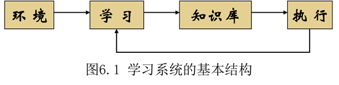

2. 统计：学习模型、历史数据、新数据、未知属性

## 归纳学习

### 定义

归纳学习（induction learning)是从特定的实事和数据出发，应用归纳规则进行学习的一种方法。根据归纳学习有无教师指导，可把它分为示例学习和观察与发现学习。

### 学习模式

1. 给定

   1. 观察陈述（事实）*F*，用以表示有关某些对象、状态、过程等的特定知识；
   2. 假定的初始归纳断言（可能为空）；
   3. 背景知识，用于定义有关观察陈述、候选归纳断言以及任何相关问题领域知识、假设和约束，其中包括能够刻画所求归纳断言的性质的优先准则。

2. 求

   归纳断言（假设）*H*，能重言蕴涵或弱蕴涵观察陈述，并满足背景知识。

### 归纳概括规则

### 学习方法

1. 示例学习/实例学习
2. 观察发现学习

##  决策树学习

### 决策树定义

1. 通过把实例从根节点排列到某个叶子节点来分类实例。
2. 叶子节点即为实例所属的分类
3. 树上每个节点说明了对实例的某个属性的测试
4. 节点的每个后继分支对应于该属性的一个可能值

决策树代表实例属性值约束的合取的析取式。从树根到树叶的每一条路径对应一组属性测试的合取，树本身对应这些合取的析取

### 实例

1. 正实例：产生正值决策的实例
2. 负实例：产生负值决策的实例

### 决策树算法★

> CLS和ID3选一个考

#### 决策树构造算法CLS

##### 算法流程

> 按照个人理解修改了一下

1. 如果TR中所有实例分类结果均为C~i~，则返回C~i~;
2. 从属性表中选择某一属性A作为检测属性;
3. 假定|ValueType(A~i~)|=k，根据不同的ValueType(A~i~)，将TR划分为k个集 TR~1~，TR~2~ ，…，TR~k~;
   1. ValueType(A~i~)：属性A的第i种取值
   2. |ValueType(A~i~)|=k：属性A有k种不同的取值
4. 从属性表中去掉已做检验的属性A;
5. 对每一个i (l≤i≤k)，用 TR~i~，和新的属性表递归调用CLS，生成TR~i~的决策树DTR~i~;
6. 返回以属性A为根，以DTR~1~，DTR~2~ ，…， DTR~k~为子树的决策树。

##### 举例

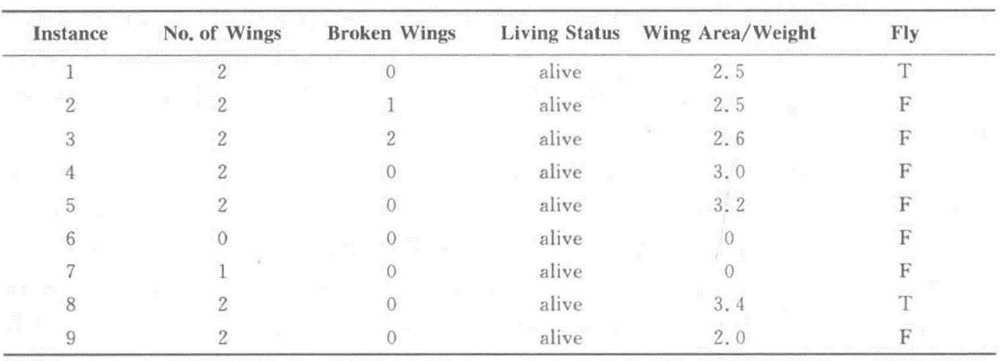

#### [决策树学习算法ID3✦](https://github.com/3210448723/HnustExam/blob/main/%E6%95%B0%E6%8D%AE%E6%8C%96%E6%8E%98%E5%A4%8D%E4%B9%A0%E7%AC%94%E8%AE%B0/%E7%AC%94%E8%AE%B0.md)

> 实质上是在CLS的基础上用信息增益的方法来选择决策属性/检测属性

ID3是一种自顶向下增长树的贪婪算法，在每个结点选取能最好地分类样例的属性。继续这个过程直到这棵树能完美分类训练样例，或所有的属性都使用过了。

##### 信息熵

###### 定义

是对随机变量不确定度的度量，熵越⼤，随机变量的不确定性就越⼤。

###### 公式

##### 信息增益

###### 定义

针对特征而言的，就是看一特征，系统有它和没有它时的信息量各是多少，两者的差值就是这个特征给系统带来的信息量，即信息增益。

###### 公式

#### 伪代码

1. 来源[数据挖掘笔记](https://github.com/3210448723/HnustExam/blob/main/%E6%95%B0%E6%8D%AE%E6%8C%96%E6%8E%98%E5%A4%8D%E4%B9%A0%E7%AC%94%E8%AE%B0/%E7%AC%94%E8%AE%B0.md)

   * 输入：训练数据集D，特征集A ，阈值 $\epsilon$ 
   
   * 输出：以node为根节点的——棵决策树
   
     

2. 来源PPT（推荐，省略了信息熵的计算细节）

   * 输入
     1. Examples：训练样例集。
     2. Target_attribute：这棵树要预测的目标属性。
     3. Attributes：除Target_attribute外供学习到的决策树测试的属性列表。
   
   * 输出：能正确分类给定Examples的决策树Root。
   
   * 伪代码
   
     ID3(Examples, Target_attribute, Attributes)
   
     1. 创建树的Root结点
   
     2. 如果Examples都为正，那么返回label= + 的单结点树Root
   
     3. 如果Examples都为反，那么返回label= - 的单结点树Root
   
     4. 如果Attributes为空，那么返回单结点树Root，label=Examples中最普遍的Target _attribute值
   
     5. 否则
   
        1. A←Attributes中分类 Examples 能力最好的属性
   
           > 具有最高信息增益的属性
   
        2. Root的决策属性←A
   
        3. 对于A的每个可能值v~i~;
   
           1. 在Root下加一个新的分支对应测试A=v~i~
           2. 令 $Examples_{v_{i}}$ 为Examples中满足A属性值为v~i~的子集
           3. 如果 $Examples_{v_{i}}$ 为空
              1. 在这个新分支下加一个叶子结点，结点的label=Examples中最普遍的Target_attribute值
              2. 否则在这个新分支下加一个子树 ID3( $Examples_{v_{i}}$ ,Target_attribute, Attributes-{A})
   
     6. 结束
   
     7. 返回Root

## 类比学习

### 推理过程

回忆与联想→选择→建立对应关系→转换

### 过程

1. 输入一组已知条件和一组未完全确定的条件。
2. 对两组输入条件寻找其可类比的对应关系。
3. 根据相似转换的方法，进行映射。
4. 对类推得到的知识进行校验。

### 研究类型

1. 问题求解型
2. 预测推定型

## 解释学习

### EBG

#### 求解形式

给定

1. 目标概念描述*TC*；
2. 训练实例*TE*；
3. 领域知识*DT*；
4. 操作准则*OC*。

 求解

  训练实例的一般化概括，使之满足：

1. 目标概念的充分概括描述*TC*；
2. 操作准则*OC*。

#### 步骤

1. 解释，即根据领域知识建立一个解释，以证明训练实例如何满足目标概念定义。目标概念的初始描述通常是不可操作的。
2. 概括（一般化），即对第(1)步的证明树进行处理，对目标概念进行回归，包括用变量代替常量以及必要的新项合成等工作，从而得到所期望的概念描述。

## 神经网络学习

### 两大学派

#### 化学学派

认为人脑经学习所获得的信息是记录在某些生物大分子之上的。例如，蛋白质、核糖核酸、神经递质，就像遗传信息是记录在DNA（脱氧核糖核酸）上一样。

#### 突触修正学派

* 人脑学习所获得的信息是分布在神经元之间的突触连接上的
* 人脑的学习和记忆过程实际上是一个在训练中完成的突触连接权值的修正和稳定过程。其中，学习表现为突触连接权值的修正，记忆则表现为突触连接权值的稳定
* 是人工神经网络学习和记忆机制研究的心理学基础，与此对应的权值修正学派也一直是人工神经网络研究的主流学派。

### 学习方法

#### 有师学习

能够根据期望的和实际的网络输出（对应于给定输入）间的差来调整神经元间连接的强度。

#### 无师学习

不需要知道期望输出。

#### 增强学习

采用一个“评论员”来评价与给定输入对应的神经网络输出的优度（质量因数）。增强学习算法的一个例子是遗传算法（GA）。

### 反向传播（BP）算法

是一种有师学习

#### 核心思想

* 将输出误差以某种形式通过隐层向输入层逐层反传
* 给定训练模式，利用传播公式，沿着减小误差的方向不断调整网络连接权值和阈值的过程

#### 学习过程

信号的正向传播，误差的反向传播

#### 步骤✦

1. 初始化
2. 输入训练样本对，计算各层输出
3. 计算网络输出误差
4. 计算各层误差信号
5. 调整各层权值
6. 检查网络总误差是否达到精度要求。
   1. 满足，则训练结束；
   2. 不满足，则返回步骤2

#### 程序流程图

#### 基于Hopfield网络学习

反馈神经网络，它是一种动态反馈系统，比前馈网络具有更强的计算能力。

Hopfield网络是一种具有正反相输出的带反馈人工神经元。

## 知识发现

### 定义

数据库中的知识发现（Knowledge Discovery in Databases ，KDD）是从大量数据中辨识出有效的、新颖的、潜在有用的、并可被理解的模式的高级处理过程。

### 处理过程

1. 数据选择。根据用户的需求从数据库中提取与KDD相关的数据。
2. 数据预处理。主要是对上述数据进行再加工，检查数据的完整性及数据的一致性，对丢失的数据利用统计方法进行填补，形成发掘数据库。
3. 数据变换。即从发掘数据库里选择数据。
4. 数据挖掘。根据用户要求，确定KDD的目标是发现何种类型的知识。
5. 知识评价。这一过程主要用于对所获得的规则进行价值评定，以决定所得的规则是否存入基础知识库。

### 方法

1. 统计
2. 机器学习
3. 神经计算
4. 可视化

### 应用

金融业、保险业、制造业、市场和零售业、医疗业、司法、工程与科学

## 增强学习

### 学习自动机

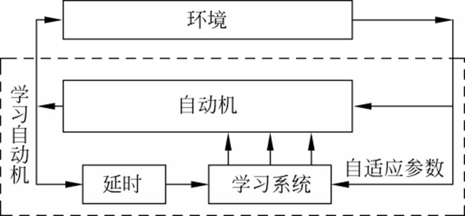

### 自适应动态程序设计（时差学习）

在自适应动态程序设计中，状态i的效应值U(i)可以用下式计算：

### Q学习（Q-值代替效用值）

一种基于时差策略的增强学习，是指定在给定的状态下，在执行完某个动作后期望得到的效用函数，该函数为动作-值函数。

## 深度学习

### 定义

深度学习算法是一类基于生物学对人脑进一步认识，将神经-中枢-大脑的工作原理设计成一个不断迭代、不断抽象的过程，以便得到最优数据特征表示的机器学习算法；该算法从原始信号开始，先做低层抽象，然后逐渐向高层抽象迭代，由此组成深度学习算法的基本框架。

### 特点

1. 使用多重非线性变换对数据进行多层抽象
2. 以寻求更适合的概念表示方法为目标
3. 形成一类具有代表性的特征表示学习（Learning representation）方法

### 优点

1. 采用非线性处理单元组成的多层结构，使得概念提取可以由简单到复杂
2. 架构非常灵活，有利于根据实际需要调整学习策略
3. 学习无标签数据优势明显

### 模型

卷积神经网络、循环神经网络、受限玻耳兹曼机、自动编码器、深度信念网络

### 应用

机器博弈、计算机视觉、语音识别、机器人…

## 习题

### 6-1 什么是学习和机器学习?为什么要研究机器学习?

1. **学习**就是系统在不断**重复**的工作中对本身能力的**增强或者改进**，使得系统在下一次执行同样任务或类似任务时，会比现在**做得更好或效率更高**。

2. **机器学习**是研究如何使用机器来**模拟人类学习活动**的一门学科，是一门研究机器获取新知识和新技能，并识别现有知识的学问。

   > 这里所说的“机器”，指的就是计算机。

3. **原因**：现有的计算机系统和人工智能系统没有什么学习能力，至多也只有**非常有限**的学习能力，因而**不能满足**科技和生产提出的新要求。

### 6-2 试述机器学习系统的基本结构，并说明各部分的作用。

1. **环境**向系统的**学习**部分提供某些**信息**
2. 学习部分利用这些信息**修改**知识库，以增进系统执行部分完成任务的效能
3. 执行部分根据知识库**完成任务**，同时把获得的**信息反馈**给学习部分。

影响学习系统设计的最重要的因素是环境向系统提供的信息。更具体地说是**信息的质量**。

###  6-3 简介决策树学习的结构※

[详见](#决策树定义)

### 6-4 决策树学习的主要学习算法

[以ID3为例](#决策树学习算法ID3★)

###  6-8 试比较说明符号系统和连接机制在机器学习中的主要思想※

[详见人工智能的各种认知观的对比部分](#人工智能的各种认知观)

### 6-9 用C语言编写一套计算机程序，用于执行 BP 学习算法

详见[BP算法](#反向传播（BP）算法)实现步骤

###  什么是知识发现？知识发现与数据挖掘有何关系？※

1. [知识发现的定义](#知识发现)

2. 关系

   数据挖掘是知识发现中的一个步骤，它主要是利用某些特定的知识发现算法，在一定的运算效率内，从数据中发现出有关的知识。

###  什么是深度学习？它有何特点？※

[详见深度学习的定义和特点](#深度学习)

# 开放题/论述题

## 对AI发展的看法以及研究热点★

> GPT-4

### 看法

* 人工智能在过去的几十年里取得了**巨大的进步**。随着计算能力的提高和大量数据的积累，深度学习和机器学习技术得到了**广泛的应用**。AI已经渗透到了诸如自动驾驶、医疗诊断、语言翻译、虚拟助手等许多行业。
* 在未来，我们预期 AI 将在各个领域产生更多的影响，**提高生产效率**，**改变**人们的生**活方式**。 
* 然而，AI发展也引发了一些关切。例如，隐私、数据安全、失业、道德伦理等问题需要解决。因此，政策制定者、研究人员和产业界需要共同努力，确保AI技术的安全、可靠、公平和透明。

### [研究热点](#1-11 人工智能的主要研究和应用领域是什么？其中，哪些是新的研究热点？)

1. 强化学习：通过让机器学习在特定环境中进行试错，以获取最佳策略的方法。在游戏、机器人控制和自动驾驶等领域有广泛应用。
2. 生成对抗网络（GAN）：一种用于生成数据的深度学习方法，通过让两个神经网络相互竞争来提高生成数据的质量。广泛应用于图像合成、风格迁移等任务。
3. 自然语言处理（NLP）：关注让计算机理解、生成和处理自然语言的技术。目前研究热点包括预训练语言模型、机器翻译、情感分析等。
4. 计算机视觉：关注让计算机理解和处理图像或视频的技术。研究热点包括目标检测、人脸识别、图像分割等。
5. 无监督学习和半监督学习：在训练数据缺乏标签的情况下，让机器学习模型自我学习的方法。这些方法在处理大量未标注数据时具有巨大潜力。
6. 人工智能伦理和政策：关注AI技术带来的道德、法律和社会影响，以及如何制定相应的政策和规范。
7. 机器学习的可解释性：让机器学习模型更加透明和可解释的研究。这有助于提高人们对AI系统的信任，增加模型的可靠性和安全性。
8. 神经符号整合：探索将深度学习和传统符号逻辑相结合的方法，以解决AI系统在推理、抽象和知识表示方面的局限性。
9. 多模态学习：让AI系统能够处理和理解来自多种感官（如视觉、听觉、触觉等）的信息。这有助于开发更加智能和
   自适应的AI系统。
10. 元学习（Meta-learning）：通过让AI系统自我学习如何学习，以提高模型在新任务和领域的泛化能力。
11. 小样本学习：研究如何在少量标注数据的情况下，让机器学习模型实现高效的学习。这有助于降低AI系统对大量标
    注数据的依赖。
12. 安全AI：研究如何确保AI系统在各种条件下的安全性、稳定性和可控性，包括抵御对抗性攻击、防止模型崩溃等。
13. 人工智能与心理学、神经科学的交叉研究：通过模仿人类大脑和认知过程来发展AI系统，以提高其智能和适应能力。
